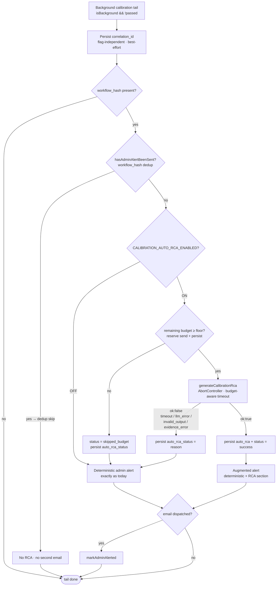

# Post-Creation Calibration Flow

> **Last Updated**: 2026-06-27

## Overview

This doc describes the **post-creation calibration** feature: after an agent is created in the V2 thread-based flow (`/v2/agents/new`), the user is offered a one-click calibration that runs **in the background on real data**, emails them the result, and **gates the agent** until it passes. It also covers how the agent's own outbound messages are **marked and redirected** while a calibration is running.

It's gated behind the feature flag **`NEXT_PUBLIC_MOVE_TO_CALIBRATION_AFTER_AGENT_CREATION`** (default **OFF** → legacy behavior, nothing changes). Full design history: [`docs/workplans/v2-post-creation-calibration-prompt-workplan.md`](../workplans/v2-post-creation-calibration-prompt-workplan.md).

## Flow

```
Agent created (/api/create-agent)
        │  flag ON
        ▼
Post-creation prompt: "Test it now?" (runs on REAL data — make sure data is ready)
   ├─ Accept → calibration_status='running' → fire POST /api/v2/calibrate/batch {background:true}
   │           (client does NOT await) → navigate to /v2/agent-list
   │           server runs calibration to completion, then emails the result
   └─ Decline → calibration_status='skipped' → navigate to /v2/agent-list
```

- **Background execution:** the client fires the existing batch route with `background:true` and navigates away. Calibration completes within the Vercel function limit, and the function keeps running after the client disconnects — **no queue/worker**. The batch route's `try/finally` tail records the gate outcome (for *every* run, so a manual sandbox pass also unlocks) and, for background runs, sends the result email.
- **Result email** ([`lib/calibration/calibrationResultEmail.ts`](../../lib/calibration/calibrationResultEmail.ts)): LLM-built summary (deterministic fallback), CTA → agent page on pass, sandbox on fail.

## Access gate — `agents.calibration_status`

New enum column: `running | passed | failed | skipped` (**NULL = legacy/pre-existing, read-time deferred**). Drives the agent-list badge, hover tooltip, click-routing, and run guard. All gating is **behind the flag** (OFF ⇒ nothing gated; legacy agents open normally).

| Status | Dashboard/agent-list | Click → | Runnable |
|---|---|---|---|
| `running` | "Calibrating…" | "still running, please wait" toast | no |
| `failed` | "Needs attention" | sandbox (`?gated=1`) to review & fix | no |
| `skipped` / `NULL` (flag ON) | "Not calibrated" | sandbox to run calibration | no |
| `passed` | — | agent page | yes |

**Unlock rule:** an agent opens normally only once `calibration_status='passed'` (a clean run). `setCalibrationStatus` is written by the batch route tail; `recordCalibrationPromptDecision` seeds `running`/`skipped` from the prompt. Both on `AgentRepository`.

> ⚠️ **Rollout:** the flag is a global `NEXT_PUBLIC_` build-time flag — enabling it in production gates *every* existing agent (NULL = deferred) until calibrated. Decide full-fleet vs a cutoff before a production enable. Rollback is instant (flag OFF).

## Email transport (provider-agnostic)

[`lib/notifications/emailTransport.ts`](../../lib/notifications/emailTransport.ts) — `sendEmail()` tries, in order, and falls back automatically:

```
Resend (RESEND_API_KEY starts with "re_")   →   env Gmail OAuth2 (GMAIL_*)   →   owner's google-mail plugin connection (ownerUserId)   →   console preview
```

`NotificationService` delegates both the calibration result email and human-approval emails to it. `scripts/validate-resend.mjs` and `scripts/validate-gmail.mjs` diagnose the env providers.

## Calibration outbound-message marking + recipient redirect

Calibration runs the **real** workflow, so side-effecting steps (e.g. Gmail `send_email`) actually fire — multiple times (dry-run + each loop iteration). To make that safe and clear:

- **Marker:** `StepExecutor` injects `params._calibration = { isCalibration, round, redirectTo }` during calibration runs only (mirrors the `_idempotency_key` pattern; engine stays plugin-agnostic). `round` is monotonic across the dry-run + iterations (threaded via `ExecutionContext.calibrationRound`). `redirectTo` is the agent owner's email (`ExecutionContext.calibrationOwnerEmail`, from the batch route's `user.email`).
- **Banner:** messaging executors call `BasePluginExecutor.getCalibrationNotice(params)` for a subject prefix + body banner (round shown only from #2 onward, so a single-send calibration has no "round" noise).
- **Recipient redirect:** the Gmail executor sends the test **to the owner** instead of the real recipients, and notes the original recipients in the banner — so a calibration test never reaches a real third party. The marker is generic; applying the redirect/banner to other messaging executors (Slack, SMS) is a follow-up.

## Admin failure alert + automated RCA (best-effort augmentation)

Separate from the *owner* result email above, a **failed** background calibration also fires an **internal admin failure alert** (IMP-2, [`lib/calibration/calibrationAdminAlert.ts`](../../lib/calibration/calibrationAdminAlert.ts)) so the platform team can start a root-cause analysis (RCA). Recipients come from `AdminAccessService.listAdminEmails()`; the alert is deduped by `workflow_hash` (one alert per broken agent version) and is internal-only ("do not forward").

Historically that alert stopped at *raw evidence* — the remaining issues plus a `dump-calibration.ts` command. It is now **augmented** with an **automated RCA**: at failure time the tail calls the in-app **RCA service** ([`lib/calibration/calibrationRcaService.ts`](../../lib/calibration/calibrationRcaService.ts)), which reads the same persisted evidence the manual RCA reads (calibration outcome **and** the agent's workflow definition, via repositories), runs the `calibration-rca` 6-step method through a single provider-factory LLM call, and returns a Zod-validated 8-field conclusion + one of the 5 root-cause layers. On success the conclusion is rendered as an additive section in the same email and persisted to `calibration_history.metadata.auto_rca`.

The augmentation is **best-effort, gated, and never-throws** — it augments the alert when it succeeds within budget and silently falls back to today's deterministic email otherwise. Gated by the server-only env flag **`CALIBRATION_AUTO_RCA_ENABLED`** (see [feature_flags.md](../feature_flags.md)); **OFF ⇒ deterministic email exactly as today, no LLM call, no RCA-metadata write at all**.

Durable markers written to the failed `calibration_history` row (all via `CalibrationHistoryRepository.mergeMetadata`, which re-reads current metadata so writes compose without clobbering):

| Key | When written | Purpose |
|---|---|---|
| `correlation_id` | **every** non-passing background run — flag-independent, before the dedup branch | durable log-join key |
| `auto_rca_status` + `auto_rca_attempted_at` | flag **ON** only — for **every attempt**: `success` \| `timeout` \| `llm_error` \| `invalid_output` \| `evidence_error` \| `skipped_budget` | records that an RCA was attempted (and its outcome) even when it failed/skipped |
| `auto_rca` (+ `_generated_at`, `_model`, `_provider`) | flag **ON** + generation succeeded | the persisted RCA a human can start the manual RCA from |

### Flow — both flag branches



**Never-throws envelope:** the whole block (correlationId persist → dedup → RCA → persist → send → mark) runs inside the tail's `try/catch`; any failure in generation, persistence, or send is logged via Pino and swallowed — the alert is never lost because the RCA step failed, and the route response / gate update are unaffected. Full design: [`docs/workplans/AUTOMATED_CALIBRATION_RCA_EMAIL_WORKPLAN.md`](../workplans/AUTOMATED_CALIBRATION_RCA_EMAIL_WORKPLAN.md) and the manual method it productionizes, [`CALIBRATION_RCA_RUNBOOK.md`](./CALIBRATION_RCA_RUNBOOK.md).

## Code anchors

| Concern | File |
|---|---|
| Prompt + gating UI + flow-map step | `app/v2/agents/new/page.tsx`, `app/v2/agent-list/page.tsx`, `app/v2/sandbox/[agentId]/page.tsx` |
| Decision route | `app/api/v2/agents/[agentId]/calibration-decision/route.ts` |
| Background run + email tail + round/owner threading | `app/api/v2/calibrate/batch/route.ts` |
| Gate state | `lib/repositories/AgentRepository.ts` (`recordCalibrationPromptDecision`, `setCalibrationStatus`) |
| Marker + redirect | `lib/pilot/StepExecutor.ts`, `lib/pilot/ExecutionContext.ts`, `lib/server/base-plugin-executor.ts`, `lib/server/gmail-plugin-executor.ts`, `lib/pilot/shadow/DryRunValidator.ts` |
| Email | `lib/notifications/emailTransport.ts`, `lib/pilot/NotificationService.ts`, `lib/calibration/calibrationResultEmail.ts` |
| Admin failure alert + automated RCA | `lib/calibration/calibrationAdminAlert.ts`, `lib/calibration/calibrationRcaService.ts`, `lib/calibration/calibrationRcaConfig.ts`, `lib/calibration/calibrationRcaPrompt.ts`, `lib/calibration/calibrationRca-schema.ts` |

## Change History

| Date | Change | Details |
|------|--------|---------|
| 2026-07-05 | Automated RCA augmentation | Added the **Admin failure alert + automated RCA** section: the best-effort, flag-gated (`CALIBRATION_AUTO_RCA_ENABLED`) LLM RCA that augments the internal admin failure alert, its persisted markers (`correlation_id`, `auto_rca_status`/`auto_rca_attempted_at`, `auto_rca`), a both-branches Mermaid flow diagram (flag ON vs OFF, dedup skip, budget skip, never-throws envelope), and the RCA-service code anchors. |
| 2026-06-27 | Created | Documents Phases 1–5 of the post-creation calibration feature: prompt, background run, `calibration_status` gate, provider-agnostic email, outbound marking + recipient redirect. |
