# Legacy Conversational Agent Creation Flow - Sequence Diagram

## Overview
This document maps the complete flow from when a user provides an initial prompt through the conversational UI to when the agent is saved in the `agents` table.

---

## Sequence Diagram

```mermaid
sequenceDiagram
    participant User
    participant ConversationalBuilder as ConversationalAgentBuilder.tsx
    participant Hook as useConversationalBuilder.ts
    participant API1 as /api/analyze-prompt-clarity
    participant API2 as /api/generate-clarification-questions
    participant API3 as /api/enhance-prompt
    participant Parent as AgentBuilderParent.tsx
    participant SmartBuilder as SmartAgentBuilder.tsx
    participant GenHook as useAgentGeneration.ts
    participant API4 as /api/generate-agent-v2
    participant API5 as /api/create-agent
    participant DB as Supabase (agents table)

    Note over User,DB: PHASE 1: Initial Prompt & Analysis

    User->>ConversationalBuilder: Enters initial prompt (e.g., "Send emails to Slack")
    ConversationalBuilder->>Hook: initialPrompt prop triggers useEffect

    Note over Hook: Generate agentId (UUID) & sessionId (UUID)<br/>Store in useRef for consistency

    Hook->>Hook: processPrompt() triggered after 500ms
    Hook->>Hook: Set hasProcessedInitialPrompt = true
    Hook->>Hook: Set isCurrentlyProcessing = true
    Hook->>Hook: Add user message to messages array

    Hook->>API1: POST /api/analyze-prompt-clarity
    Note over Hook,API1: Payload:<br/>- prompt<br/>- userId<br/>- sessionId<br/>- agentId<br/>- connectedPlugins: []

    API1->>API1: Analyze prompt with LLM
    API1->>API1: Calculate clarity score
    API1->>API1: Detect missing plugins
    API1-->>Hook: Response: { analysis, clarityScore, needsClarification, missingPlugins }

    Hook->>Hook: updateRequirementsFromAnalysis()
    Hook->>ConversationalBuilder: Update projectState with clarity score & analysis

    alt Clarity Score < 90 and needsClarification = true
        Note over Hook,API2: PHASE 2: Generate Questions

        Hook->>API2: POST /api/generate-clarification-questions
        Note over Hook,API2: Payload:<br/>- prompt<br/>- userId<br/>- sessionId<br/>- agentId<br/>- analysis (from Phase 1)<br/>- connectedPlugins

        API2->>API2: Generate clarification questions with LLM
        API2-->>Hook: Response: { questionsSequence, clarityScore }

        Hook->>Hook: Filter valid questions (must have id, question, type)
        Hook->>ConversationalBuilder: Update projectState with questionsSequence
        Hook->>ConversationalBuilder: Set currentQuestionIndex = 0
        Hook->>ConversationalBuilder: Set questionsWithVisibleOptions

        Note over User,ConversationalBuilder: User answers questions one by one

        loop For each question
            ConversationalBuilder->>User: Display question via QuestionRenderer
            User->>ConversationalBuilder: Select answer or type custom answer
            ConversationalBuilder->>Hook: handleOptionSelect() or handleCustomAnswer()
            Hook->>Hook: Store answer in clarificationAnswers[questionId]
            Hook->>Hook: proceedToNextQuestion()
            Hook->>Hook: Increment currentQuestionIndex
        end

        Hook->>Hook: Auto-enhancement useEffect triggered
        Note over Hook: Condition: currentQuestionIndex === -1<br/>AND all questions answered

        Hook->>Hook: Build fullPrompt with answers
        Note over Hook: Format: "original prompt\n\nAdditional details:\ndimension: answer"
    else Clarity Score >= 90
        Note over Hook: Skip questions, enhance directly
    end

    Note over Hook,API3: PHASE 3: Enhanced Prompt Generation

    Hook->>API3: POST /api/enhance-prompt
    Note over Hook,API3: Payload:<br/>- prompt (with answers appended)<br/>- clarificationAnswers<br/>- userId<br/>- sessionId<br/>- agentId<br/>- connectedPlugins<br/>- missingPlugins

    API3->>API3: Generate enhanced prompt with LLM
    API3->>API3: Format as structured plan
    API3-->>Hook: Response: { enhancedPrompt }

    Hook->>Hook: Store enhancedPrompt in projectState
    Hook->>Hook: Set enhancementComplete = true
    Hook->>Hook: Set conversationCompleted = true
    Hook->>Hook: Set workflowPhase = 'approval'
    Hook->>ConversationalBuilder: Add AI message with enhanced plan

    Note over User,ConversationalBuilder: APPROVAL PHASE

    ConversationalBuilder->>User: Display enhanced plan with "Use This Plan" button
    User->>ConversationalBuilder: Clicks "Use This Plan" (or "Edit Plan")
    ConversationalBuilder->>Hook: handleApproveEnhanced()

    Hook->>Hook: Set userApproved = true
    Hook->>Hook: Set isReadyToBuild = true
    Hook->>Hook: Set planApproved = true
    Hook->>Hook: Set workflowPhase = 'completed'

    Hook->>Parent: onPromptApproved() callback
    Note over Hook,Parent: Payload:<br/>- prompt: enhancedPrompt<br/>- promptType: 'enhanced'<br/>- clarificationAnswers: {<br/>  ...answers,<br/>  agentId: agentId.current,<br/>  sessionId: sessionId.current<br/>}

    Note over Parent,SmartBuilder: SMART BUILDER PHASE

    Parent->>Parent: handlePromptApproved()
    Parent->>Parent: Store conversationalState in localStorage
    Parent->>Parent: Set currentPhase = 'smart'
    Parent->>Parent: Set allowNavigation = true

    Parent->>SmartBuilder: Render SmartAgentBuilder component
    Note over Parent,SmartBuilder: Props:<br/>- prompt (enhanced)<br/>- promptType: 'enhanced'<br/>- clarificationAnswers (includes agentId & sessionId)

    SmartBuilder->>SmartBuilder: Extract agentId from clarificationAnswers
    SmartBuilder->>SmartBuilder: Extract sessionId from clarificationAnswers
    SmartBuilder->>SmartBuilder: Store in useRef for consistency

    Note over SmartBuilder: Auto-generate agent on mount

    SmartBuilder->>GenHook: generateAgent()
    Note over SmartBuilder,GenHook: Uses consistent agentId & sessionId from refs

    GenHook->>API4: POST /api/generate-agent-v2
    Note over GenHook,API4: Payload:<br/>- prompt<br/>- promptType<br/>- clarificationAnswers<br/>- userId<br/>Headers:<br/>- x-user-id<br/>- x-session-id<br/>- x-agent-id

    API4->>API4: Generate agent configuration with LLM
    API4->>API4: Parse workflow_steps
    API4->>API4: Parse input_schema
    API4->>API4: Parse output_schema
    API4->>API4: Extract plugins_required
    API4->>API4: Build system_prompt
    API4-->>GenHook: Response: { agent }

    GenHook->>SmartBuilder: setAgent(generatedAgent)
    SmartBuilder->>User: Display generated agent preview

    Note over User,SmartBuilder: User reviews agent (can edit)

    User->>SmartBuilder: Clicks "Create Agent" button
    SmartBuilder->>SmartBuilder: handleCreateAgent()
    SmartBuilder->>SmartBuilder: Validate agent
    SmartBuilder->>SmartBuilder: Set isCreating = true

    SmartBuilder->>SmartBuilder: Build agentData object
    Note over SmartBuilder: Includes:<br/>- agent_config (JSONB with metadata)<br/>- pilot_steps (normalized workflow)<br/>- workflow_steps<br/>- system_prompt<br/>- input_schema<br/>- output_schema<br/>- connected_plugins<br/>- schedule configuration

    SmartBuilder->>API5: POST /api/create-agent
    Note over SmartBuilder,API5: Payload:<br/>- agent: agentData<br/>- sessionId: sessionId.current<br/>- agentId: agentId.current<br/>Headers:<br/>- x-user-id<br/>- x-session-id<br/>- x-agent-id

    API5->>API5: Extract userId from headers
    API5->>API5: Use providedAgentId || agent.id
    Note over API5: Critical: Maintains ID consistency<br/>for token tracking

    API5->>API5: Prepare agentData with all fields
    API5->>API5: Test Supabase connection

    API5->>DB: INSERT INTO agents
    Note over API5,DB: Fields:<br/>- id (from frontend agentId)<br/>- agent_name<br/>- user_prompt<br/>- user_id (from auth)<br/>- system_prompt<br/>- description<br/>- input_schema (JSONB)<br/>- output_schema (JSONB)<br/>- connected_plugins (array)<br/>- workflow_steps (JSONB array)<br/>- pilot_steps (JSONB array)<br/>- agent_config (JSONB)<br/>- status: 'draft'<br/>- mode: 'on_demand'<br/>- schedule_cron<br/>- timezone<br/>- ai_reasoning<br/>- ai_confidence<br/>- created_from_prompt<br/>- ai_generated_at

    DB-->>API5: Success: { data: agent }

    API5->>API5: Log audit trail (async, non-blocking)
    API5-->>SmartBuilder: Response: { success: true, agent }

    SmartBuilder->>SmartBuilder: setIsCreating = false
    SmartBuilder->>Parent: onAgentCreated(savedAgent)

    Parent->>Parent: Clear localStorage storage
    Parent->>User: Navigate to agent dashboard or agent detail page

    Note over User,DB: ✅ Agent Creation Complete
```



---

## Key Components & Files

### Frontend Components
1. **[ConversationalAgentBuilder.tsx](components/agent-creation/ConversationalAgentBuilder.tsx)**
   - Main UI component for conversational flow
   - Displays messages, questions, and enhanced plan
   - Handles user interactions

2. **[useConversationalBuilder.ts](components/agent-creation/useConversationalBuilder.ts)**
   - Core orchestration hook
   - Manages 3-API sequence (analyze → questions → enhance)
   - Maintains agentId & sessionId in useRef
   - Handles state management and question flow

3. **[AgentBuilderParent.tsx](components/agent-creation/AgentBuilderParent.tsx)**
   - Parent orchestrator between conversational and smart builder phases
   - Manages phase transitions
   - Handles localStorage persistence
   - Passes agentId & sessionId through clarificationAnswers

4. **[SmartAgentBuilder.tsx](components/agent-creation/SmartAgentBuilder/SmartAgentBuilder.tsx)**
   - Agent configuration and preview UI
   - Extracts agentId from clarificationAnswers
   - Initiates agent generation
   - Handles final agent creation

5. **[useAgentGeneration.ts](components/agent-creation/SmartAgentBuilder/hooks/useAgentGeneration.ts)**
   - Hook for calling /api/generate-agent-v2
   - Parses LLM-generated agent configuration

### API Routes

1. **[/api/analyze-prompt-clarity](app/api/analyze-prompt-clarity/route.ts)** (Phase 1)
   - Analyzes initial user prompt
   - Calculates clarity score
   - Detects required plugins
   - Returns analysis object

2. **[/api/generate-clarification-questions](app/api/generate-clarification-questions/route.ts)** (Phase 2)
   - Generates targeted questions based on analysis
   - Returns questionsSequence array
   - Updates clarity score

3. **[/api/enhance-prompt](app/api/enhance-prompt/route.ts)** (Phase 3)
   - Takes original prompt + answers
   - Generates enhanced, detailed automation plan
   - Returns formatted enhanced prompt

4. **[/api/generate-agent-v2](app/api/generate-agent-v2/route.ts)** (Smart Builder)
   - Generates complete agent configuration
   - Parses workflow_steps, input_schema, output_schema
   - Extracts plugins and builds system_prompt

5. **[/api/create-agent](app/api/create-agent/route.ts)** (Database Save)
   - Validates agent data
   - Uses providedAgentId for consistency
   - Inserts into `agents` table
   - Logs audit trail

### Database

**Table: `agents`**
- Primary storage for all agent configurations
- Key fields:
  - `id` (UUID) - Uses agentId from frontend for tracking consistency
  - `agent_name` (text)
  - `user_prompt` (text)
  - `system_prompt` (text)
  - `input_schema` (JSONB)
  - `output_schema` (JSONB)
  - `workflow_steps` (JSONB array)
  - `pilot_steps` (JSONB array)
  - `agent_config` (JSONB) - Metadata including sessionId, promptType, etc.
  - `connected_plugins` (text array)
  - `schedule_cron` (text)
  - `timezone` (text)
  - `status` (text) - 'draft', 'active', etc.
  - `mode` (text) - 'on_demand', 'scheduled', 'triggered'

---

## Critical ID Tracking Flow

The system maintains **consistent agentId and sessionId** throughout the entire flow:

1. **Generation** (useConversationalBuilder.ts:30-40)
   ```typescript
   const sessionId = useRef(generateUUID());
   const agentId = useRef(generateUUID());
   ```

2. **Phase 1-3 API Calls** (useConversationalBuilder.ts:100-600)
   - All API calls include headers: `x-session-id`, `x-agent-id`
   - Payload includes: `sessionId`, `agentId`

3. **Approval Callback** (useConversationalBuilder.ts:1276-1299)
   ```typescript
   onPromptApproved?.({
     prompt: projectState.enhancedPrompt,
     promptType: 'enhanced',
     clarificationAnswers: {
       ...projectState.clarificationAnswers,
       agentId: agentId.current,  // ← Passed here
       sessionId: sessionId.current
     }
   });
   ```

4. **SmartBuilder Extraction** (SmartAgentBuilder.tsx:133-144)
   ```typescript
   const agentId = useRef(
     clarificationAnswers?.agentId ||  // ← Extracted here
     generateUUID()
   );
   ```

5. **Database Insert** (create-agent/route.ts:103-116)
   ```typescript
   const finalAgentId = providedAgentId || agent.id;
   const agentData = {
     ...(finalAgentId && { id: finalAgentId }),  // ← Used here
     // ... other fields
   };
   ```

This ensures token usage tracking, audit logs, and all metadata remain consistent across the entire workflow.

---

## State Transitions

### ProjectState Workflow Phases
```
initial
  ↓ (User enters prompt)
questions
  ↓ (All questions answered)
enhancement
  ↓ (Enhanced prompt generated)
approval
  ↓ (User approves plan)
completed
  ↓ (Navigate to SmartBuilder)
agent_created
  ↓ (Agent saved to DB)
(Navigate away or clear storage)
```

---

## Data Flow Summary

1. **User Input** → `initialPrompt`
2. **Phase 1** → `analysis`, `clarityScore`, `missingPlugins`
3. **Phase 2** → `questionsSequence`
4. **User Answers** → `clarificationAnswers`
5. **Phase 3** → `enhancedPrompt`
6. **Approval** → Pass to SmartBuilder with `agentId` & `sessionId`
7. **Generation** → `agent` object (workflow, schema, prompt)
8. **Validation** → Validate all required fields
9. **Database Save** → INSERT into `agents` table
10. **Complete** → Return to dashboard with created agent

---

## Important Notes

### UUID Generation
- Uses custom UUID v4 generator for database compatibility
- Format: `xxxxxxxx-xxxx-4xxx-yxxx-xxxxxxxxxxxx`
- Generated once at start, maintained in useRef

### Plugin Handling
- Detected in Phase 1 (analyze-prompt-clarity)
- Can show warnings for missing plugins
- Locked after conversational phase (if configured)
- Stored in `connected_plugins` array in database

### Scheduling
- Configured in SmartBuilder
- Supports cron expressions
- Includes timezone (from user profile or UTC default)
- Mode: 'on_demand', 'scheduled', or 'triggered'

### Error Handling
- Each API call wrapped in try/catch
- Validation at multiple points
- User-friendly error messages
- Fallback to direct enhancement if questions fail

### Storage & Persistence
- localStorage used for cross-phase state
- Keys: `agent_builder_conversational_state`, `agent_builder_smart_state`
- Auto-clears on session timeout (30 minutes)
- Cleared after successful agent creation

---

## Next Steps for V2 UI

To mimic this behavior in the new v2 UI ([ConversationalAgentBuilderV2.tsx](components/agent-creation/conversational/ConversationalAgentBuilderV2.tsx)), ensure:

1. ✅ **Thread-based flow** maintains same agentId/sessionId consistency
2. ✅ **Phase 3 enhanced prompt** is properly structured and passed
3. ✅ **Approval callback** includes agentId & sessionId in clarificationAnswers
4. ✅ **SmartBuilder integration** extracts IDs correctly
5. ✅ **Database save** uses the same `/api/create-agent` endpoint
6. ✅ **agent_config JSONB** includes all metadata (v8 prompt, mini-cycle, etc.)

---

**Document Version:** 1.0
**Last Updated:** 2025-01-18
**Author:** Development Team
**Status:** Complete Documentation
