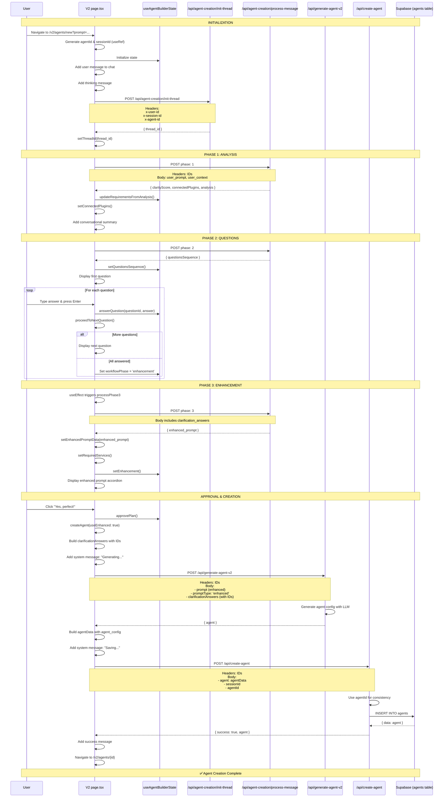

# V2 Agent Creation & Save Implementation Guide

## Overview
This document describes how to implement the complete agent creation flow in the new V2 UI ([app/v2/agents/new/page.tsx](app/v2/agents/new/page.tsx)), including transitioning to SmartAgentBuilder and saving to the `agents` table. This guide builds upon the legacy flow documented in [LEGACY_CONVERSATIONAL_AGENT_CREATION_SEQUENCE.md](LEGACY_CONVERSATIONAL_AGENT_CREATION_SEQUENCE.md).

---

## Current V2 Flow Status

### ✅ Implemented (Phase 1-4)
1. **Thread Initialization** - Creates OpenAI thread with v9 prompt
2. **Phase 1: Analysis** - Analyzes prompt, returns clarity score and connected plugins
3. **Phase 2: Questions** - Generates clarification questions, user answers
4. **Phase 3: Enhancement** - Creates enhanced prompt with structured data
5. **UI Components** - Avatar icons, message bubbles, enhanced prompt accordion
6. **Service Status** - Connected/not connected service badges

### ❌ Not Implemented (Agent Creation)
1. **SmartAgentBuilder Integration** - Transition from conversational to smart builder
2. **Agent Generation** - Call `/api/generate-agent-v2` with enhanced prompt
3. **Agent Creation** - Call `/api/create-agent` to save to database
4. **ID Consistency** - Pass agentId & sessionId through entire flow
5. **Navigation** - Return to dashboard or agent detail after creation

---

## Implementation Plan

### Step 1: Generate Consistent IDs (✅ Partially Done)

The V2 flow already has thread-based state, but we need to add agentId & sessionId tracking like the legacy flow.

**Add to [app/v2/agents/new/page.tsx](app/v2/agents/new/page.tsx) state (after line 96):**

```typescript
// ID tracking (for consistency with token tracking)
const sessionId = useRef(generateUUID())
const agentId = useRef(generateUUID())

// UUID generator (same as SmartAgentBuilder)
const generateUUID = () => {
  return 'xxxxxxxx-xxxx-4xxx-yxxx-xxxxxxxxxxxx'.replace(/[xy]/g, function(c) {
    const r = Math.random() * 16 | 0;
    const v = c === 'x' ? r : (r & 0x3 | 0x8);
    return v.toString(16);
  });
};

console.log('🆔 V2 Agent Builder initialized with IDs:', {
  agentId: agentId.current,
  sessionId: sessionId.current,
  threadId
});
```

**Why**: These IDs ensure consistency across:
- Token usage tracking
- Audit logs
- Database foreign key relationships
- SmartAgentBuilder integration

---

### Step 2: Update API Calls to Include IDs

**Modify all API fetch headers in [page.tsx](app/v2/agents/new/page.tsx):**

```typescript
// In initializeThread (line ~220)
const res = await fetch('/api/agent-creation/init-thread', {
  method: 'POST',
  headers: {
    'Content-Type': 'application/json',
    'x-user-id': user.id,
    'x-session-id': sessionId.current,  // ← Add
    'x-agent-id': agentId.current        // ← Add
  }
})

// In processPhase1 (line ~270)
const res = await fetch('/api/agent-creation/process-message', {
  method: 'POST',
  headers: {
    'Content-Type': 'application/json',
    'x-user-id': user.id,
    'x-session-id': sessionId.current,  // ← Add
    'x-agent-id': agentId.current        // ← Add
  },
  body: JSON.stringify({
    thread_id: threadId,
    phase: 1,
    user_prompt: initialPrompt,
    user_context: {
      full_name: user.user_metadata?.full_name || '',
      email: user.email || ''
    },
    analysis: null,
    connected_services: []
  })
})

// Repeat for processPhase2 and processPhase3
```

---

### Step 3: Implement Agent Creation Logic

**Add new function in [page.tsx](app/v2/agents/new/page.tsx) (after handleEdit, ~line 485):**

```typescript
/**
 * Create agent after user approves enhanced plan
 * Follows the same flow as legacy: SmartBuilder -> generate -> save
 */
const createAgent = async (useEnhanced: boolean = true) => {
  console.log('🚀 Starting agent creation process...')

  try {
    setIsLoading(true)
    addSystemMessage('Generating your agent configuration...')

    // Step 1: Build clarificationAnswers with IDs (critical for SmartBuilder)
    const clarificationAnswers = {
      ...builderState.clarificationAnswers,
      agentId: agentId.current,
      sessionId: sessionId.current
    }

    const promptToUse = useEnhanced
      ? builderState.enhancedPrompt
      : builderState.originalPrompt

    console.log('📋 Creating agent with:', {
      promptType: useEnhanced ? 'enhanced' : 'original',
      agentId: agentId.current,
      sessionId: sessionId.current,
      answersCount: Object.keys(clarificationAnswers).length
    })

    // Step 2: Call /api/generate-agent-v2 (same as SmartAgentBuilder)
    const generateRes = await fetch('/api/generate-agent-v2', {
      method: 'POST',
      headers: {
        'Content-Type': 'application/json',
        'x-user-id': user.id,
        'x-session-id': sessionId.current,
        'x-agent-id': agentId.current
      },
      body: JSON.stringify({
        prompt: promptToUse,
        promptType: useEnhanced ? 'enhanced' : 'original',
        clarificationAnswers: clarificationAnswers,
        userId: user.id
      })
    })

    if (!generateRes.ok) {
      throw new Error('Failed to generate agent configuration')
    }

    const { agent } = await generateRes.json()
    console.log('✅ Agent generated:', agent.agent_name)

    addSystemMessage(`Generated agent: ${agent.agent_name}`)

    // Step 3: Build agent data with agent_config (metadata)
    const agentData = {
      ...agent,

      // Critical: Include agent_config JSONB field
      agent_config: {
        creation_metadata: {
          ai_generated_at: new Date().toISOString(),
          session_id: sessionId.current,
          agent_id: agentId.current,
          prompt_type: useEnhanced ? 'enhanced' : 'original',
          clarification_answers: clarificationAnswers,
          version: '1.0',
          platform_version: 'v2.0',
          thread_id: threadId,
          enhanced_prompt_data: enhancedPromptData // Full structured prompt
        },

        ai_context: {
          reasoning: agent.ai_reasoning || '',
          confidence: agent.ai_confidence || 0,
          original_prompt: builderState.originalPrompt,
          enhanced_prompt: builderState.enhancedPrompt,
          generated_plan: agent.generated_plan || null,
          detected_categories: agent.detected_categories || []
        }
      }
    }

    // Step 4: Save to database via /api/create-agent
    addSystemMessage('Saving agent to database...')

    const createRes = await fetch('/api/create-agent', {
      method: 'POST',
      headers: {
        'Content-Type': 'application/json',
        'x-user-id': user.id,
        'x-session-id': sessionId.current,
        'x-agent-id': agentId.current
      },
      body: JSON.stringify({
        agent: agentData,
        sessionId: sessionId.current,
        agentId: agentId.current
      })
    })

    if (!createRes.ok) {
      const error = await createRes.json()
      throw new Error(error.error || 'Failed to create agent')
    }

    const { agent: savedAgent } = await createRes.json()
    console.log('✅ Agent saved to database:', savedAgent.id)

    addAIMessage(`🎉 Success! Your agent "${savedAgent.agent_name}" has been created!`)

    // Step 5: Navigate to agent detail page
    setTimeout(() => {
      router.push(`/v2/agents/${savedAgent.id}`)
    }, 2000)

  } catch (error) {
    console.error('❌ Agent creation error:', error)
    addAIMessage(`Sorry, there was an error creating your agent: ${error.message}`)
  } finally {
    setIsLoading(false)
  }
}
```

---

### Step 4: Update Approval Handlers

**Replace handleApprove and handleUseOriginal (line ~456-484):**

```typescript
// Handle approve plan (use enhanced prompt)
const handleApprove = async () => {
  console.log('✅ User approved enhanced plan')
  approvePlan()
  addAIMessage('Excellent! Creating your agent with the enhanced plan...')

  // Create agent with enhanced prompt
  await createAgent(true)
}

// Handle use original
const handleUseOriginal = async () => {
  console.log('📝 User chose to use original prompt')
  approvePlan()
  addAIMessage(`Perfect! Creating your agent with your original request...`)

  // Create agent with original prompt
  await createAgent(false)
}

// Handle edit plan
const handleEdit = () => {
  console.log('✏️ User wants to edit plan')
  startEditingEnhanced()
  addAIMessage('You can now edit the plan. Make your changes and click "Save Changes".')

  // TODO: Implement inline editing
  // When user saves edits, update builderState.enhancedPrompt and re-display accordion
}
```

---

### Step 5: Store Enhanced Prompt Data

**In processPhase3 (line ~361), ensure we store the full structured object:**

```typescript
const processPhase3 = async () => {
  // ... existing code ...

  const data = await res.json()
  console.log('✅ Phase 3 response:', data)

  // ✅ CRITICAL: Store FULL enhanced_prompt object (not just string)
  setEnhancedPromptData(data.enhanced_prompt)

  // Also store as string for backward compatibility
  const enhancedPrompt = typeof data.enhanced_prompt === 'string'
    ? data.enhanced_prompt
    : JSON.stringify(data.enhanced_prompt, null, 2)

  setEnhancement(enhancedPrompt)

  // Store required services
  if (data.enhanced_prompt?.specifics?.services_involved) {
    setRequiredServices(data.enhanced_prompt.specifics.services_involved)
    console.log('✅ Phase 3 - Required services stored:', data.enhanced_prompt.specifics.services_involved)
  }

  // Add message
  addAIMessage("Perfect! I've created a detailed plan for your automation:")
}
```

---

### Step 6: Add Loading States

**Update UI to show loading during agent creation:**

```typescript
// In the return JSX, replace the TODO comment in handleApprove button:

{/* Approval buttons */}
<div className="grid grid-cols-2 gap-3">
  <button
    onClick={handleApprove}
    disabled={isLoading}  // ← Add disabled state
    className={`px-6 py-3 bg-gradient-to-r from-emerald-500 to-green-600 text-white font-semibold flex items-center justify-center gap-2 transition-all ${
      isLoading ? 'opacity-50 cursor-not-allowed' : 'hover:from-emerald-600 hover:to-green-700'
    }`}
    style={{ borderRadius: 'var(--v2-radius-button)', boxShadow: 'var(--v2-shadow-button)' }}
  >
    {isLoading ? (
      <>
        <Loader2 className="h-5 w-5 animate-spin" />
        Creating...
      </>
    ) : (
      <>
        <CheckCircle className="h-5 w-5" />
        Yes, perfect!
      </>
    )}
  </button>

  <button
    onClick={handleEdit}
    disabled={isLoading}  // ← Add disabled state
    className={`px-6 py-3 bg-[var(--v2-surface)] border-2 border-[var(--v2-border)] text-[var(--v2-text-primary)] font-semibold flex items-center justify-center gap-2 transition-all ${
      isLoading ? 'opacity-50 cursor-not-allowed' : 'hover:border-[var(--v2-primary)] hover:bg-[var(--v2-surface-hover)]'
    }`}
    style={{ borderRadius: 'var(--v2-radius-button)' }}
  >
    <Edit className="h-5 w-5" />
    Need changes
  </button>
</div>
```

---

## Complete Flow Diagram



---

## Data Flow Summary

### 1. **IDs Generated** (on mount)
```typescript
agentId: "550e8400-e29b-41d4-a716-446655440000"
sessionId: "6ba7b810-9dad-11d1-80b4-00c04fd430c8"
threadId: "thread_abc123" (from API)
```

### 2. **Phase 1 Response**
```json
{
  "clarityScore": 65,
  "connectedPlugins": ["google-sheets"],
  "analysis": { ... },
  "conversationalSummary": "I understand you want to..."
}
```

### 3. **Phase 2 Response**
```json
{
  "questionsSequence": [
    { "id": "q1", "question": "...", "type": "text" }
  ]
}
```

### 4. **Phase 3 Response**
```json
{
  "enhanced_prompt": {
    "plan_title": "Email Summary Automation",
    "plan_description": "This automation will...",
    "sections": {
      "data": "...",
      "processing_steps": ["Step 1", "Step 2"],
      "output": "...",
      "delivery": "..."
    },
    "specifics": {
      "services_involved": ["gmail", "slack"],
      "user_inputs_required": [],
      "trigger_scope": "Manual"
    }
  }
}
```

### 5. **clarificationAnswers (with IDs)**
```json
{
  "q1": "Every day at 9am",
  "q2": "key points and action items",
  "agentId": "550e8400-e29b-41d4-a716-446655440000",
  "sessionId": "6ba7b810-9dad-11d1-80b4-00c04fd430c8"
}
```

### 6. **Generated Agent (from /api/generate-agent-v2)**
```json
{
  "agent_name": "Email Summary Automation",
  "user_prompt": "Summarize my emails daily",
  "system_prompt": "You are an email summarization agent...",
  "description": "Automatically summarizes emails",
  "input_schema": { "type": "object", "properties": {...} },
  "output_schema": { "type": "object", "properties": {...} },
  "workflow_steps": [...],
  "pilot_steps": [...],
  "connected_plugins": ["gmail"],
  "plugins_required": ["gmail"],
  "ai_reasoning": "...",
  "ai_confidence": 85,
  "generated_plan": "..."
}
```

### 7. **Agent Data with agent_config (for /api/create-agent)**
```json
{
  ...agent,
  "agent_config": {
    "creation_metadata": {
      "ai_generated_at": "2025-01-18T10:30:00.000Z",
      "session_id": "6ba7b810-9dad-11d1-80b4-00c04fd430c8",
      "agent_id": "550e8400-e29b-41d4-a716-446655440000",
      "prompt_type": "enhanced",
      "clarification_answers": { ... },
      "version": "1.0",
      "platform_version": "v2.0",
      "thread_id": "thread_abc123",
      "enhanced_prompt_data": { ... }
    },
    "ai_context": {
      "reasoning": "...",
      "confidence": 85,
      "original_prompt": "...",
      "enhanced_prompt": "...",
      "generated_plan": "...",
      "detected_categories": [...]
    }
  }
}
```

### 8. **Saved to Database**
```sql
INSERT INTO agents (
  id,  -- Uses agentId from frontend
  agent_name,
  user_prompt,
  system_prompt,
  description,
  input_schema,
  output_schema,
  workflow_steps,
  pilot_steps,
  connected_plugins,
  plugins_required,
  agent_config,  -- JSONB metadata
  status,
  mode,
  user_id,
  created_at,
  updated_at
) VALUES (...)
```

---

## Key Differences from Legacy Flow

### Legacy Flow
1. **AgentBuilderParent.tsx** - Manages phase transitions
2. **localStorage** - Persists state between phases
3. **SmartAgentBuilder component** - Separate UI for agent config
4. **Manual navigation** - User sees transition to smart builder

### V2 Flow
1. **Single page.tsx** - All-in-one conversational + creation
2. **No localStorage** - State managed in React
3. **No separate UI** - Agent created directly after approval
4. **Seamless UX** - User stays in conversation

---

## Testing Checklist

### ID Consistency
- [ ] `agentId` generated on mount and stored in useRef
- [ ] `sessionId` generated on mount and stored in useRef
- [ ] Both IDs sent in all API call headers
- [ ] Both IDs included in `clarificationAnswers`
- [ ] Both IDs sent to `/api/create-agent`
- [ ] Database record uses frontend `agentId`

### API Integration
- [ ] `/api/generate-agent-v2` called with correct payload
- [ ] `agent_config` JSONB includes all metadata
- [ ] `/api/create-agent` receives `agentId` and `sessionId`
- [ ] Token tracking works (agentId consistency)

### User Experience
- [ ] Loading states show during agent creation
- [ ] Success message displays after save
- [ ] Navigation to agent detail page works
- [ ] Error handling shows user-friendly messages
- [ ] No duplicate API calls

### Data Integrity
- [ ] Enhanced prompt stored in `agent_config`
- [ ] Clarification answers preserved
- [ ] Thread ID included in metadata
- [ ] All plugin data saved correctly

---

## Error Handling

### Common Issues

**1. Missing IDs**
```typescript
if (!agentId.current || !sessionId.current) {
  throw new Error('Agent ID or Session ID not initialized')
}
```

**2. Failed Agent Generation**
```typescript
if (!generateRes.ok) {
  const error = await generateRes.json()
  addAIMessage(`Failed to generate agent: ${error.error}`)
  throw new Error(error.error)
}
```

**3. Failed Database Save**
```typescript
if (!createRes.ok) {
  const error = await createRes.json()
  addAIMessage(`Failed to save agent: ${error.error}`)
  // Don't navigate away - let user retry
  throw new Error(error.error)
}
```

**4. Network Errors**
```typescript
try {
  await createAgent(true)
} catch (error) {
  console.error('Agent creation error:', error)
  addAIMessage('Sorry, something went wrong. Please try again.')
  setIsLoading(false)
}
```

---

## Future Enhancements

### 1. Agent Preview Before Save
Show agent configuration preview similar to SmartAgentBuilder before final save:
```typescript
const [showAgentPreview, setShowAgentPreview] = useState(false)
const [generatedAgent, setGeneratedAgent] = useState(null)

// After generate-agent-v2 call
setGeneratedAgent(agent)
setShowAgentPreview(true)

// User can review and then click "Create Agent" to save
```

### 2. Edit Enhanced Prompt
Implement inline editing of the enhanced prompt:
```typescript
const handleSaveEditedPrompt = () => {
  setBuilderState(prev => ({
    ...prev,
    enhancedPrompt: prev.editedEnhancedPrompt,
    isEditingEnhanced: false
  }))

  // Re-display accordion with updated content
  setEnhancedPromptData(parseEnhancedPrompt(prev.editedEnhancedPrompt))
}
```

### 3. Thread Resume
Save thread state to allow users to resume:
```typescript
// Save to localStorage on state change
useEffect(() => {
  localStorage.setItem('v2_agent_builder_state', JSON.stringify({
    threadId,
    builderState,
    agentId: agentId.current,
    sessionId: sessionId.current
  }))
}, [threadId, builderState])

// Restore on mount
useEffect(() => {
  const saved = localStorage.getItem('v2_agent_builder_state')
  if (saved) {
    const { threadId, builderState, agentId, sessionId } = JSON.parse(saved)
    // Restore state...
  }
}, [])
```

---

## Files to Modify

1. **[app/v2/agents/new/page.tsx](app/v2/agents/new/page.tsx)** (~150 lines added)
   - Add `agentId` and `sessionId` refs
   - Add `createAgent()` function
   - Update `handleApprove()` and `handleUseOriginal()`
   - Add loading states to buttons
   - Include IDs in all API call headers

2. **[hooks/useAgentBuilderState.ts](hooks/useAgentBuilderState.ts)** (no changes needed)
   - State management already supports required fields

3. **API Routes** (no changes needed)
   - `/api/agent-creation/init-thread`
   - `/api/agent-creation/process-message`
   - `/api/generate-agent-v2`
   - `/api/create-agent`

---

## Estimated Implementation Time

- **ID Tracking**: 30 minutes
- **createAgent Function**: 1-2 hours
- **UI Updates (buttons, loading)**: 1 hour
- **Testing & Debugging**: 2-3 hours
- **Total**: 5-7 hours

---

## Next Steps

1. ✅ Review this documentation
2. ⬜ Implement ID tracking (Step 1)
3. ⬜ Add IDs to API headers (Step 2)
4. ⬜ Implement `createAgent()` function (Step 3)
5. ⬜ Update approval handlers (Step 4)
6. ⬜ Add loading states (Step 6)
7. ⬜ Test complete flow end-to-end
8. ⬜ Verify database record has correct ID
9. ⬜ Test navigation to agent detail page
10. ⬜ Deploy to production

---

**Document Version**: 1.0
**Last Updated**: 2025-01-18
**Author**: Development Team
**Status**: Implementation Guide - Ready for Development

**Dependencies**:
- [LEGACY_CONVERSATIONAL_AGENT_CREATION_SEQUENCE.md](LEGACY_CONVERSATIONAL_AGENT_CREATION_SEQUENCE.md)
- [CONVERSATIONAL_UI_NEW_V2_COMPLETE.md](CONVERSATIONAL_UI_NEW_V2_COMPLETE.md)
