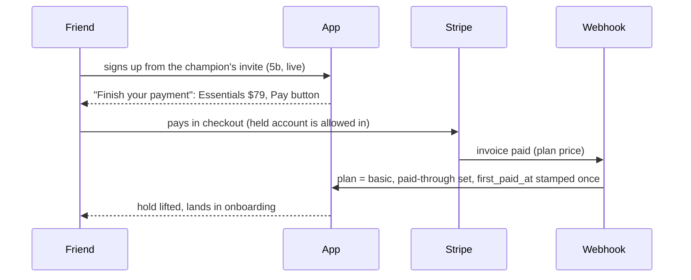
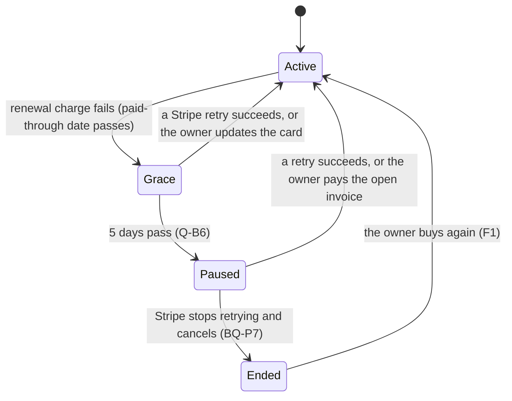
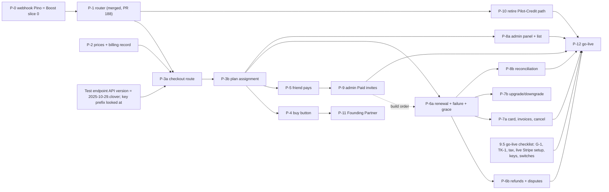

# Requirement: Business OS Plan Payments (Stripe)

> **Last Updated**: 2026-10-07

**Created by:** BA
**Date:** 2026-10-02
**Status:** SA approved with conditions C-1 to C-12 (see "SA Review — 2026-10-02"); C-12 text corrections applied. All business questions decided 2026-10-02 (§10.1). **APPROVED by the user 2026-10-02:** "I approve the payments scope and committing the two documents in a PR; Dev can start the P-0 and P-1 workplans."
**Related:** [BUSINESS_OS_PLAN_PAYMENTS_ASBUILT.md](/docs/requirements/BUSINESS_OS_PLAN_PAYMENTS_ASBUILT.md) (SA as-built, 2026-10-02: the authority on what exists), [BUSINESS_OS_TIER_BILLING_REUSE_PLAN.md](/docs/requirements/BUSINESS_OS_TIER_BILLING_REUSE_PLAN.md) (plan of record: Q-B, RD, Q-T, S-4a, WS-1/2/3, TK), [BUSINESS_OS_INVITE_SIGNUP_REQUIREMENT.md](/docs/requirements/BUSINESS_OS_INVITE_SIGNUP_REQUIREMENT.md) (§7.6, §7.7, §7.9, Slice 5c, F5c-1 to F5c-4), [BUSINESS_OS_ENTITLEMENTS.md](/docs/architecture/BUSINESS_OS_ENTITLEMENTS.md), [BUSINESS_OS_CREDIT_PRICING.md](/docs/architecture/BUSINESS_OS_CREDIT_PRICING.md), [BUSINESS_OS_CREDITS_BOOST_REQUIREMENT.md](/docs/requirements/BUSINESS_OS_CREDITS_BOOST_REQUIREMENT.md) (sibling; untracked in the main checkout on this date; shares the webhook dispatcher).

## Overview

A Business OS owner can pay us a monthly subscription for a plan, and Stripe charges them every month until they cancel. Self-serve buyers choose a plan in Settings → Plan; an invited friend, or an admin's Paid invitee, pays at signup and is then let into the product. Customers can upgrade, downgrade, cancel, reactivate, update their card and see their invoices. When a card fails, Stripe retries, the account gets 5 days of grace, and then it pauses. Admins can see, per account and across all accounts, who is paying, who is failing, and where Stripe and our plan record disagree. Everything is in USD at the decided prices. **Out of scope:** annual plans and add-ons (Q-B8, RD-11), multi-currency and VAT (OI-1), credit boosts (the Credits Boost requirement), and switching enforcement on (reuse-plan S-2 and S-5).

This document scopes the reuse plan's **S-4a** (WS-1, WS-2, WS-3) together with invite **Slice 5c**. It adds the parts the plan of record did not cover: recurring-payment rules stated end to end, admin monitoring, and a small-slice delivery order. It does not re-decide anything: earlier decisions are cited by id.

---

## Table of Contents

1. [Conventions](#1-conventions)
2. [Scope](#2-scope)
3. [What exists and what is missing](#3-what-exists-and-what-is-missing)
4. [Findings to fix](#4-findings-to-fix)
5. [The flows](#5-the-flows)
6. [Recurring-payment rules](#6-recurring-payment-rules)
7. [Admin monitoring](#7-admin-monitoring)
8. [Safety requirements](#8-safety-requirements)
9. [Proposed slices](#9-proposed-slices)
10. [Business questions for the user](#10-business-questions-for-the-user)
11. [For SA](#11-for-sa)
12. [Acceptance criteria](#12-acceptance-criteria)
13. [Notes on integration points](#13-notes-on-integration-points)

---

## 1. Conventions

| Item | Convention |
|---|---|
| Plan names | Internal ids, per RD-14: `basic`, `pro` (tiers), `trial`, `champion` (cohorts). The customer names are Essentials, Autopilot, Test Flight and Founding Partner, held as data in `presentation` and `cohorts.ts`. |
| Prices | `basic` $79 and `pro` $129 a month, USD only (Q-B2, RD-13). |
| Ids in this document | **F1 to F10** flows · **PF-n** findings to fix · **SR-n** safety requirements · **P-n** slices · **BQ-Pn** business questions · **SA-Pn** items for SA · **AC-Fn.m** acceptance criteria |
| "Paid-through date" | The plan row's `tier_expires_at`, which is Stripe's current-period end (as-built §3.1) |
| "Held" | An invited account that has not paid yet and is kept on the "finish your payment" screen (invite GR-4, FR-24, FR-35) |
| "Enforced" | Nothing about plans is refused until reuse-plan S-5 switches enforcement on. Before that, the lifecycle (grace, paused) is **recorded, not acted on**. The invite payment hold is the exception: it is a page gate and works today (invite GR-5). |

---

## 2. Scope

| In scope | Out of scope (and where it lives) |
|---|---|
| Monthly subscription to `basic` or `pro` through Stripe, on fixed prices (RD-1, Q-T1) | Annual prices (Q-B8), add-ons, Flex (RD-11) |
| Self-serve buy, upgrade, downgrade, cancel, reactivate, card update, invoice list (Q-B5, RD-6, WS-2) | Credit boosts (Credits Boost requirement) |
| Friend pays at signup, and already-held friends pay later (invite 5c, FR-37) | Perks on first payment (invite §14, FR-38) |
| Admin Paid invites switched on (invite FR-22 to FR-26, F5c-3) | Reminders or deletion for unpaid invitees (invite BQ-8) |
| Admin-assigned (sales-assisted) plans coexisting with Stripe (Q-B5, Q-T9) | Multi-currency, VAT, tax invoices (OI-1) |
| Renewal, failed payment, 5-day grace, pause, recovery (Q-B6, RD-8) | Switching enforcement on (S-2, S-5); refusing AI at zero credits (credit deduction slices 9–10) |
| Founding Partner converting to paid, with the founder discount (D-6, WS-1) | Price changes for existing subscribers and grandfathering at renewal |
| Admin monitoring v1 (§7) | Self-serve refunds; refund policy beyond "no refunds" (Q-B7) |
| Retiring the Pilot-Credit purchase path (WS-3, RD-12) | Agent-platform billing beyond that retirement (E-2) |

---

## 3. What exists and what is missing

Detail and file evidence: [as-built](/docs/requirements/BUSINESS_OS_PLAN_PAYMENTS_ASBUILT.md).

| Area | Exists | Missing | As-built |
|---|---|---|---|
| Stripe plumbing | SDK, embedded checkout envelope, portal, invoice list, cancel/reactivate methods, proration policy | Fixed prices with lookup keys; a Business OS checkout route | §2 |
| Webhook | Signature check, one endpoint, two-phase claim | A Business OS branch; deny-by-default routing; reclaiming stuck claims. **Live hazard:** a plan invoice carrying `user_id` would become Pilot Credits today | §2, G-6, G-7 |
| Where the customer is recorded | Only `user_subscriptions`, which Business OS may not use (RD-2) | A Business OS home for the Stripe customer and subscription ids | G-4 |
| Plan row | Tier, paid-through date, credit-period anchor | A safe way for the webhook to assign a plan (system actor, audit, no period reset) | §3.2, G-9 |
| Lifecycle | Grace and paused are derived from the paid-through date | Nothing produces `past_due`; grace config is 7 days, not 5 | §3.1, G-10 |
| Held friends | Hold gate, lineage `first_paid_at` columns, holding screen | Any way to release a friend; the UPDATE grant | §3.3 |
| Customer surface | Read-only "Your plan" (WS-2 step 1), localised (step 1b, not recorded as closed) | Buy, change, cancel, card, invoices | §1.1 |
| Admin | Per-account plan state (Tiers page), invites list, credit reports, cron health | Anything about payments, subscriptions, failures, webhooks or reconciliation | §5 |

---

## 4. Findings to fix

Places where the code contradicts a decision. These are defects to fix inside the slices, **not** new questions. PF-9 to PF-15 were added by the SA review (SA-3), with SA's severity.

| # | Decision | What the code does | Fix in |
|---|---|---|---|
| **PF-1** | Paid-lapse grace is **5 days** (Q-B6, RD-8, Q-T7) | `subscriptionGraceHistory` is 7 days (G-10) | P-6a (moved from P-2 by SA): append a 5-day history entry, together with the PF-10 margin; never edit the old one (C-10) |
| **PF-2** | The credit period does not restart mid-cycle; the allowance resets per period (credit deduction FR-18) | `assign_tier` sets `period_anchor = now` on every call, so a renewal or upgrade through it would restart the credit period (as-built §4) | P-3b (SA-P2) |
| **PF-3** | The webhook's plan assignment "inherits the audit entry" (Q-T2) | Audit and cache invalidation live in the admin route, not in `executeAdminOp`, and an admin id is required (G-9) | P-3b (SA-P3) |
| **PF-4** | Deny by default; unknown never means credits (RD-4) | A platform invoice with `user_id` metadata is converted to Pilot Credits, with a first-subscription fallback (G-6) | P-1 |
| **PF-5** | Idempotent, never silently lost (L-12) | A claim stuck at `processing` is never reclaimed, so a paid invoice can be lost (G-7) | P-8b, before go-live (→ §9.5 go-live checklist, row 1) |
| **PF-6** | Disputes and refunds are recorded, not ignored (by analogy with boost FR-35/FR-36) | Plan-payment disputes and refunds fall through to "unknown payment" (G-15) | P-6b, resolved via the Basil invoice-payment lookup (PF-9) |
| **PF-7** | WS-2 step 1b (localisation) gates any screen that asks for payment (reuse plan §4.6c, F5c-4) | It appears done but no document records the gate as closed | P-4: QA records it closed, or fixes the gap |
| **PF-8** | Env vars are documented | No `STRIPE_*` variable is in `.env.example` (G-14) | P-2 |
| **PF-9** (High) | The webhook reads the shapes of the Stripe API version in use, `2025-10-29.clover` (SA-1) | **Basil-era Stripe shapes.** On `2025-10-29.clover` the invoice line's price is `line.pricing.price_details.price` (not `line.price`), the invoice's subscription is `invoice.parent.subscription_details.subscription`, the period end is on subscription **items**, and `charge.invoice` is gone (resolve a refund or dispute via the PaymentIntent's invoice payments). A router written against older shapes would deny every plan invoice, or route nothing | P-1 (router), P-3b, P-6b; each with a fixture test from a real test-mode payload (C-8) |
| **PF-10** (High, post S-5) | Grace is 5 days after a missed renewal (Q-B6), not a monthly state for every subscriber | **Monthly grace blip.** Stripe finalises and charges the renewal about an hour **after** the period ends, so `tier_expires_at` passes before `invoice.paid` arrives and every subscriber reads `grace` for up to an hour each month (read-only owner once S-5 is on). Ruling: store Stripe's period end verbatim, and add a **renewal settlement margin of 24 h** to lifecycle config as a history entry, applied by `deriveLifecycle` to a tier's access end before grace starts (all tiers; harmless for admin-assigned ones). The 5-day grace then counts from the end of the margin | P-6a (C-10) |
| **PF-11** (Medium) | Every money event writes an audit entry (AM-7) | **Audit only queues** (`log()`); a serverless function frozen after the 200 loses the row. The webhook must `flush()` before responding, as the admin route does | P-3b (SA-P3, C-7) |
| **PF-12** (High) | Deny by default (RD-4); never take money we will not credit | **Paying into a denied path.** After P-1, an agent-platform subscription checkout would still take money that the router then refuses to credit | P-1 (SA-P7, C-2) |
| **PF-13** (Medium) | The credit period follows billing (§6, SA-P2) | **Admin `assign_tier` on a subscribed account resets the anchor**, desynchronising the credit period from billing | P-3b (SA-P2) |
| **PF-14** (High) | A customer is never charged for an account that no longer exists | **Reset / deletion while subscribed.** A Danger-Zone reset or an account deletion that removes the plan row leaves Stripe charging. Purge, reset and deletion paths must **refuse while the billing record has a live subscription** (409 `subscription_live`) until it is cancelled; the billing record itself is retained | P-2 (registry), P-7a (refusal); before go-live (C-11; → §9.5 go-live checklist, row 1) |
| **PF-15** (Medium) | Test mode first, and test data never mixed with real money (SR-12) | **Test mode on the production database.** There is one Supabase project, so test-mode customers and plan rows land in production tables. Every billing row carries `livemode`; the webhook refuses an event whose `livemode` differs from the key's mode; admin lists and MRR filter on the current mode; demos use designated test accounts only | P-2, P-3b, P-8a (C-9); checked before live keys → §9.5 go-live checklist, rows 6 and 19 |

---

## 5. The flows

Each flow lists what the **customer** sees, what the **system** records, and what an **admin** can see. "Billing record" means the Business OS home for the Stripe customer and subscription (SA-P1). "Money history" means the per-event payment log (SA-P5).

### F1. New customer buys a plan from the plan screen (self-serve, Q-B5)

```text
Settings → Plan → "Choose Essentials" → Stripe checkout → paid → webhook → plan row = basic → "You're on Essentials"
```

| # | Customer sees | System records | Admin sees |
|---|---|---|---|
| 1 | Settings → Plan lists Essentials and Autopilot with price and contents, and a **Choose** button on each plan whose `availableToBuy` is on | — | — |
| 2 | Chooses a plan; the embedded Stripe checkout opens, in USD, with the tax wording of BQ-P5 | A Stripe customer for this person (created once, reused afterwards); a checkout session on that plan's fixed price. **Nothing on the plan row yet** | — |
| 3 | Pays; sees "Payment processing", then "You're on Essentials" with the next renewal date | On Stripe's paid invoice: plan row `tier`, paid-through date and plan version; credit period starts on the billing date (§6); billing record; money history; audit entry | Per-account billing panel: Stripe active, plan row `basic`, last payment, next renewal |
| 4 | Stripe emails a receipt | — | — |
| — | Abandons or the card is declined: stays on the plan screen, nothing changed | Nothing on the plan row | Nothing (an abandoned checkout is not a payment) |

**Who uses F1:** trial accounts, accounts with no plan, and paused accounts buying again. Founding Partners use F10, held invitees F2/F3, and paying customers F7.

**When a trial account buys, the trial ends.** The first charge is taken at once and the plan starts at once (BQ-P2, decided 2026-10-02).

### F2. Friend invite: the friend pays at signup (invite 5c)



| # | Customer sees | System records | Admin sees |
|---|---|---|---|
| 1 | The friend signs up exactly as today (5b) and lands on the holding screen, which now says **"Finish your payment"** with Essentials, its price and a **Pay** button (was "payment coming soon", FR-35) | As 5b: lineage at L2, plan row with no basis | Invites list: Accepted, L2, "signed up, not paid" |
| 2 | Pays in the checkout | The checkout **allows** a held account (G-12). It refuses if this account already has a live or pending plan subscription, so a double click cannot start a second one (SR-5) | — |
| 3 | Lands in onboarding; signing in again goes straight to the product | On the paid plan invoice: plan row `basic`; **`first_paid_at` and `first_payment_ref` stamped once** (F5c-2); money history; audit "first payment" (invite §8.3). The hold gate now lets the account in | Invites list: paid, date and amount (FR-25). Tiers page: `basic`. Billing panel as F1 |
| 4 | The **champion** sees "Subscribed" against that friend (FR-31) | Derived from `first_paid_at` | — |

**Already-held friends** (signed up under 5b before payment existed): the next time they sign in, the holding screen shows **Pay** instead of "coming soon". Nobody is emailed automatically (invite BQ-8; telling held friends is listed as future in invite §14). Admins can see the list and follow up by hand.

**Card declined at checkout:** Stripe shows the error inside the checkout; nothing is recorded; the friend stays held with no time limit and can try again (BQ-8).

**Rules carried in from earlier decisions:** the friend's plan is Essentials only (BQ-14, FR-30); after paying they can upgrade like any customer (F7). No perks on either side (FR-38). **Only a plan payment stamps `first_paid_at`, never a boost** (boost R-2). An admin may let a held friend in without paying, as an audited waiver with a required reason; it never counts as a payment (BQ-P3, decided 2026-10-02).

### F3. Admin Paid invite: the invitee pays at signup

```text
Admin creates Paid invite (basic or pro) → invitee signs up → held → checkout for the invited plan → paid → plan assigned, first_paid_at → onboarding
```

| # | Customer sees | System records | Admin sees |
|---|---|---|---|
| 1 | Invite page shows the plan the admin chose, its price, what it includes, and "payment required" (FR-22) | Invite as today (Paid type enabled once `paidInvitesAvailable` is on, F5c-3) | Invites list: Pending |
| 2 | Creates the account and lands on "finish your payment" for **the invited plan** | Lineage at L1, `admin_invite` with a tier grant; plan row with no basis. The hold predicate already covers this case (as-built §3.3) | Accepted, L1, "signed up, not paid" |
| 3 | Pays; lands in onboarding | As F2 step 3, with the invited tier | Paid, date and amount; Tiers page shows the tier |

Today an admin-issued tier invite is **refused at redemption**, so F3 needs a redemption path for it (SA-P9).

### F4. Sales-assisted or admin-assigned plan (Q-B5) next to Stripe (Q-T9)

| # | Customer sees | System records | Admin sees |
|---|---|---|---|
| 1 | Their plan in Settings → Plan, with its end date | Admin runs `assign_tier` on the Tiers page with an end date and a reason; audited. **No Stripe object** | The plan row, with origin and admin; billing panel: "No Stripe subscription" |
| 2 | Later buys through F1 | The paid invoice assigns the bought plan; the payment is the newest fact and replaces the admin assignment; audited | Billing panel: Stripe active |
| 3 | — | An admin changes the tier of an account **that has a live Stripe subscription** | The admin screen warns "Stripe is still billing for <plan>; the next renewal restores <plan>". The plan row governs access (Q-T9) until then: **every paid plan invoice re-asserts the bought tier**, so a lasting change on a subscribed account needs an override or a change to the subscription in Stripe (SA-P16b). The reconciliation flag (§7) stays up until Stripe and the plan row agree |

**Sales-assisted means an admin assigns the plan; payment, if any, is through the normal checkout.** In v1, admin actions on Stripe itself (cancel, refund) are done in the Stripe dashboard, linked from the billing panel.

### F5. Monthly renewal

```text
Billing date → Stripe charges the card → invoice paid → paid-through moves to the new period end → fresh credit allowance for the new period
```

| # | Customer sees | System records | Admin sees |
|---|---|---|---|
| 1 | Nothing in the app, apart from a new next-renewal date; Stripe emails a receipt | Paid-through date moves to the new period end (L-19). **The credit period is not restarted**: the new period starts on the billing anniversary, from the anchor set at first payment (§6, PF-2). Money history; audit | Last payment and next renewal on the billing panel |
| 2 | The credits card shows the full monthly allowance again | Nothing is written: the period is derived (as-built §4). No rollover (credit deduction FR-18). Extra credits (lots) are untouched | — |

**Renewal settlement margin (PF-10):** Stripe charges the renewal about an hour after the period ends, so the paid-through date passes before the payment arrives. A 24-hour margin after the paid-through date comes before grace, so a normal renewal never reads as grace.

### F6. Failed payment: retries, 5-day grace, paused, recovery



| # | Customer sees | System records | Admin sees |
|---|---|---|---|
| 1 | Stripe's failed-payment email; in the app, a banner "Your payment failed, update your card" with a link to update it | The failed attempt in the money history; audit. The paid-through date does **not** move, so the lifecycle reads **grace** | The account under "Failed" and "In grace", with the attempt count |
| 2 | During grace: per B-9 (read-only owner, client pages live with a warning) **once S-5 is on**; before S-5, nothing is restricted | Stripe retries on its own schedule (BQ-P7) | — |
| 3 | After 5 days: paused. **Still working for the business's clients (B-11):** invoice pay links, receipts, booking cancel and reschedule links | Lifecycle reads **paused** (derived, no job) | "Paused" |
| 4 | Fixes the card, or a retry succeeds: back to normal at once | Paid invoice → paid-through date moves → lifecycle reads active; audit | Back to "Active" |
| 5 | Stripe gives up: the subscription ends; the account stays paused, data kept; can buy again (F1) | Subscription ended on the billing record; audit | "Ended" |

**A renewal that needs the card holder's authentication** (3-D Secure) is treated as a failed payment until it is completed, and Stripe's email carries the link (SA-P8).

**Grace starts after the 24-hour renewal margin** (PF-10): the 5 days count from the end of the margin, not from the paid-through date itself.

### F7. Upgrade and downgrade (RD-7)

| | Upgrade (`basic` → `pro`) | Downgrade (`pro` → `basic`) |
|---|---|---|
| Customer sees | "Upgrade to Autopilot": the prorated amount due now, then the new plan immediately | "Switch to Essentials on <renewal date>"; keeps Autopilot until then; can undo before that date |
| Charged | The prorated difference, now | Nothing now; the lower price from the next renewal; no refund |
| System records | Plan row `pro` immediately; paid-through date unchanged; **credit period not restarted**, so the higher allowance applies to the rest of the current period; money history; audit | The scheduled change on the billing record; the plan row changes only when the renewal invoice is paid |
| Admin sees | The change and the charge | "Downgrade scheduled for <date>" |

The Stripe subscription moves to the other **fixed price**; no new price is created (L-9).

**How (SA):** an upgrade uses `proration_behavior: 'always_invoice'` with `payment_behavior: 'pending_if_incomplete'`, so it only takes effect if paid; a declined or 3-D Secure-abandoned upgrade leaves the account on `basic`. A downgrade is a **price swap with `proration_behavior: 'none'`** (no subscription schedules in v1); the plan row changes on the renewal `invoice.paid` whose line carries the lower price; undo is the reverse swap.

### F8. Cancel and reactivate (Q-B7)

| # | Customer sees | System records | Admin sees |
|---|---|---|---|
| 1 | "Cancel plan": confirms; Settings now says "Ends on <date>" with a **Reactivate** button | Cancel at period end on the billing record; audit. Nothing refunded | Under "Cancelling", with the end date |
| 2 | Reactivates before the end date: back to normal, nothing charged now | Cancellation removed; audit | Back to "Active" |
| 3 | Does nothing: on the end date the plan stops, then (after the 24-hour renewal margin, PF-10) 5 days of grace, then paused (same as F6) | The paid-through date stops moving; the lifecycle does the rest (as-built §4) | "Ended", then "In grace", then "Paused" |
| 4 | Wants it back after the end date: buys again through F1, with a new billing date | As F1 | As F1 |

### F9. Update card, view invoices and receipts

| Need | How | Note |
|---|---|---|
| Update the card | A button in Settings → Plan that opens the Stripe customer portal (L-4), limited to card and invoices (SA-P10) | Plan changes stay in the app, so RD-7 is applied in one place |
| See invoices | An in-app list in Settings → Plan (L-5): date, plan, amount, status, and a link to Stripe's hosted invoice and receipt | Read from Stripe through our records; never from `user_subscriptions` (RD-2) |
| Receipts | Stripe emails one for every paid invoice | Only if **"Successful payments" customer emails** are switched on in the Stripe dashboard (go-live item, §9.5); branding set there too |

### F10. Founding Partner converting to paid

| # | Customer sees | System records | Admin sees |
|---|---|---|---|
| 1 | Nothing changes while free access has no end date. Champions keep Autopilot-level access at $0 (entitlements doc) | — | — |
| 2 | Once an admin sets an end date: Settings → Plan says "Your free access ends on <date>. Choose a plan" | Admin `set_expiry` on the cohort, as today | The end date on the Tiers page |
| 3 | Chooses a plan; checkout shows the **founder discount** (BQ-P1) | Checkout with the discount; the first charge follows BQ-P2 | Billing panel shows the discount and when it ends |
| 4 | On the end date: carries on without a break on the paid plan | The cohort ends; the tier is in force | "Active", with the discount |
| 5 | Did not choose: champion grace (lifecycle config), then paused | Derived | "In grace", then "Paused" |

Decided 2026-10-02: 50% off the chosen plan for 24 months, once per account (BQ-P1), and the first charge on the day free access ends (BQ-P2). Technically the subscription starts with a trial to the cohort end, and its $0 invoice assigns nothing and stamps nothing (SA-P16c). F10 ships after go-live as its own slice (P-11, BQ-P4); until then champions can buy at full price through F1.

---

## 6. Recurring-payment rules

| Rule | Decision | Source |
|---|---|---|
| Billing date | Monthly, on the anniversary of the first payment (Stripe's billing anchor) | — |
| Credit period | Starts on the billing date at first payment and follows the billing anniversary afterwards. **Not restarted** by a renewal, an upgrade, a downgrade or a card fix | PF-2, credit deduction FR-18; SA-P2 |
| Allowance | Full plan allowance each period; no rollover; extra credits (lots) unaffected | FR-18; credit deduction slice 11; boost T-2 |
| Upgrade | Prorated charge now, new plan immediately | RD-7 |
| Downgrade | At the next renewal; no refund | RD-7 |
| Retries | Stripe's recommended automatic retries, about two weeks, then the subscription is cancelled | BQ-P7 (decided 2026-10-02) |
| Grace | 5 days, counted from the end of a 24-hour renewal settlement margin after the missed paid-through date (fix the 7 in config, PF-1; margin PF-10) | Q-B6, RD-8, Q-T7; PF-10 |
| Paused | After grace. Invoice pay links, receipts and booking cancel/reschedule links keep working for the business's clients | B-11 |
| Enforcement | Grace and pause are **recorded, not acted on, until S-5**. The invite payment hold is the exception | S-5, invite GR-5 |
| Cancel | At period end; access to the end; no refund | Q-B7, RD-7 |
| Reactivate | Before the end date: undo, nothing charged. After it: buy again | L-6 |
| Refunds | None by policy. An exceptional refund by an admin in the Stripe dashboard is recorded and flagged; the plan does not change automatically | Q-B7; PF-6 |
| Disputes | Recorded against the payment and flagged to admins; no automatic plan change | PF-6 |
| Receipts | Stripe emails one per paid invoice; in-app invoice list | F9 |
| Currency | USD only; no conversion shown anywhere | Q-B2, RD-13 |
| Tax | Prices shown "excluding tax"; tax recorded separately. Set before live prices exist, because Stripe does not let `tax_behavior` change. Multi-currency and VAT are OI-1 | BQ-P5 (decided 2026-10-02); OI-1; → §9.5 go-live checklist, rows 5 and 7 |
| Price shown vs price charged | The customer-facing price comes from `presentation` (display) and must equal the Stripe price behind the lookup key (charge). Stripe is the source of truth for what is charged | F-22; SA-P12 |

---

## 7. Admin monitoring

The as-built (§5) finds almost nothing for plan billing. Proposal for **v1**, reusing existing admin surfaces; everything gated by `requireAdmin` / `requireAdminPage` (L-30).

| # | What | Shows | Where (reuse) | v1 or later | Why there |
|---|---|---|---|---|---|
| AM-1 | **Per-account billing panel** | Stripe subscription status next to the plan row (Q-T9's "both side by side"): plan bought, plan in force, paid-through date, next renewal, last payment (date, amount), failed attempts, cancelling or scheduled change, discount, a "they disagree" flag, and a link to the customer in the Stripe dashboard | The account inspect view on `/admin/business-os-tiers` | **v1** | Q-T9 already puts it on the inspect route; support reads the plan row there today |
| AM-2 | **Subscriptions list** with filters: Active, In grace, Paused, Cancelling, Failed (last attempt failed), Ended, No Stripe (admin-assigned) | One row per account with plan, status, paid-through, last payment, attempts | A new tab on `/admin/business-os-tiers` | **v1** | No surface lists payments; a tab keeps plan and billing together instead of a new page |
| AM-3 | **Totals** | Active paid accounts per plan; in grace; paused; cancelling; MRR in USD (sum of net USD amounts of active subscriptions, current mode only; BQ-P6 struck by SA) | Header of the AM-2 tab | **v1** | USD only and two fixed prices make it a simple sum |
| AM-4 | **Webhook health** | Failed and stuck (`processing` too long) events, oldest first | `/admin/jobs-queues` | **v1** | Already the place for background health; `processed_webhook_events` has a failed status nobody reads |
| AM-5 | **Reconciliation** | Nightly: Stripe vs plan row disagreements, stuck claims re-processed (PF-5), paid invoices with no plan assignment. Results on AM-1/AM-2 as flags and an `error` log per finding | The credit leak-check cron pattern (`bos_cron_runs`) and its admin button | **v1** | A lost paid invoice is the worst failure here (RD-4); shared pattern with boost F-1 |
| AM-6 | **Invites paid column** | Paid / signed up not paid, date and amount (FR-25) | `/admin/business-os-invites` | **v1** (5c) | Already specified by the invite requirement |
| AM-7 | **Audit for every money event** | Checkout started, paid, failed, plan assigned, first payment stamped, upgraded, downgrade scheduled, cancelled, reactivated, ended, refund or dispute flagged, admin override on a subscribed account | `AuditTrailService` (L-31) | **v1** | Required on money events; non-blocking |
| AM-8 | Admin billing **actions** in the app (refund, cancel, change plan in Stripe) | — | — | Later | The Stripe dashboard covers them; the panel links there |
| AM-9 | Admin **alert emails** on failures | — | — | Later | No admin alert channel exists (as-built §5); v1 uses page flags and `error` logs |
| AM-10 | Churn, plan mix over time, revenue by month | — | — | Later | Needs history; not needed to operate |

**Data source:** our own records (billing record and money history), never a live Stripe call to render a list or decide access (Q-T9).

---

## 8. Safety requirements

| # | Requirement | Source |
|---|---|---|
| **SR-1** | **The deny-by-default price-id router lands before, or with, the first Business OS checkout.** Until it does, no Business OS checkout sets `user_id` metadata | RD-4, as-built G-6 |
| **SR-2** | Route on the price id from the invoice line items; metadata is a cross-check, and a disagreement is refused and alerted | RD-4 |
| **SR-3** | One webhook endpoint, one claim table | RD-4, Q-T5, Q-T11 |
| **SR-4** | Every money event is processed exactly once: redelivery, retry and reconciliation converge on the same result. A failed write releases the claim; a stuck claim is recovered (PF-5) | L-12, G-7 |
| **SR-5** | A held friend, or any account, is never charged twice for the same plan: the checkout refuses while the account has a live or pending plan subscription | — |
| **SR-6** | **A boost never stamps `first_paid_at`**, never writes the plan row or lineage. Only a plan invoice does | boost R-2, invite §6.4 |
| **SR-7** | `first_paid_at` is written once (`WHERE first_paid_at IS NULL`) through a column-level grant | F5c-2 |
| **SR-8** | The account a payment belongs to comes from our own billing record, never from Stripe metadata or the request (`tenant-isolation-guard`) | boost T-4 analogue |
| **SR-9** | Business OS billing never reads or writes `user_subscriptions`, `credit_transactions` or a Pilot-Credit balance | RD-2 |
| **SR-10** | Connect (client) payments behave identically before and after each webhook change, with before/after evidence | Q-T5, RD-12 |
| **SR-11** | An access decision never waits on a Stripe API call | Q-T9 |
| **SR-12** | **Stripe test mode first.** Every slice is demoed in test mode. Real money only after go-live (P-12; → §9.5 go-live checklist) | — |
| **SR-13** | **G-1** (service-role key rotation) is verified before any real money (→ §9.5 row 3) | G-1, invite §0.3 |
| **SR-14** | **TK-1** is recorded (the four agent-platform subscriptions: live or test mode, cancelled if live) **before any real money** (→ §9.5 row 4). Originally a P-1 merge gate (C-2); moved by the user on 2026-10-03: "we are still in testing mode, so not worries for now". P-1 merged on 2026-10-03 (#188) on that basis. P-1 recognises nothing, so every platform invoice is denied, and none is converted to Pilot Credits. If any of the four is live, its customer is charged without receiving credits until TK-1 is done. That risk was accepted with the decision | TK-1; user decision 2026-10-03 |
| **SR-15** | USD only; the Stripe checkout must not present or charge another currency | Q-B2, boost F-7 analogue |
| **SR-16** | Every route: Zod, repositories, Pino with a correlation id, CLAUDE.md error format; every money table server-write-only | CLAUDE.md rules 1–3, L-29 |
| **SR-17** | Every new import from `lib/business-os/entitlements/` is registered | `business-os-entitlements` skill |

---

## 9. Proposed slices

Small, numbered, each a few days and demoable on its own. **Test mode throughout; real money only at P-12.**

### 9.1 Slice list

| Slice | Scope title | Done means (the demo) | Depends on | Migration | State in production after merge | Est. |
|---|---|---|---|---|---|---|
| **P-0** | **Webhook logging to Pino** (= Credits Boost slice 0, already approved by the user) | Whichever session starts first does it; mechanical, no behaviour change; Connect before/after evidence | — | None | Live | small |
| **P-1** | **Price-id router, deny by default** | A test platform invoice with an unknown price is logged and refused, and no Pilot-Credit row appears. Connect tests unchanged. The Pilot-Credit invoice conversion and its first-subscription fallback are gone. The subscription branch of `app/api/stripe/create-checkout` is refused (410, logged; PF-12). The router reads Basil shapes, with fixture tests (PF-9) | P-0 merged (C-1); dispatcher owner agreed (§9.4). TK-1 moved to the go-live checklist by the user on 2026-10-03 (SR-14, §9.5). The webhook API version and key-prefix checks were moved to the P-3a gate. **Merged 2026-10-03 (#188)** | None | **Live**: protective only | 2–3d |
| **P-2** | **Plan prices and billing record** | Test-mode Stripe products and prices for `basic` and `pro` with lookup keys; the `check-bos-plan-prices` script shows both resolve to $79 / $129, equal to `presentation` (SA-P12). The billing record table `business_os_billing_accounts` exists with its full column set (SA-P1; checker passes) and is in the purge/deletion registries (PF-14). Every billing row carries `livemode` (PF-15). The Stripe env names, including the portal configuration id, documented with their mode rule in a table in [BUSINESS_OS_ENTITLEMENTS.md](/docs/architecture/BUSINESS_OS_ENTITLEMENTS.md) § Billing (PF-8, SA-P10); the tracked `.env.example` itself moves to the staging workplan C2 (P-2 SA ruling Q-4). Stripe customer helper split (Q-T8). PF-1 moved to P-6a. **Shipped as two PRs** (P-2 SA ruling Q-8): **P-2a** billing record (migration, repository, registries, customer split, env-name table) and **P-2b** plan prices (lookup-key config, catalog fill, price check and scripts, captured fixtures) | SA-P13 query answered (C-4; answered 2026-10-02, §10.2) | **20261025** | Inert | 2–3d |
| **P-3a** | **Checkout route (test mode)** | Checkout route behind a server flag: customer create, SR-5 lock, adaptive pricing off, runtime price check, held-account tier restriction. Demo: a test card pays; the router recognises a BOS plan invoice, logs that no handler exists yet, and releases the claim; no plan row changes | P-1 deployed to production (C-3), P-2. **Before any plan invoice is parsed:** the test-mode webhook endpoint's API version is confirmed as `2025-10-29.clover`, the SDK's version (Q-5, PF-9), and someone has looked at the prefix of the Vercel production `STRIPE_SECRET_KEY` (SA-P13; look only, never copy). Both are dashboard checks, because the repo's local key belongs to a separate, empty sandbox (§9.5). Both come back for live mode in §9.5. **For production to recognise a plan invoice** (P-2b): production's Stripe account holds the plan prices, `check-bos-plan-prices` passes against it, and only then `BUSINESS_OS_PLAN_PRICES_ENABLED` is turned on there (§10.2). **Code complete 2026-10-07, uncommitted, awaiting SA code review** ([P-3a workplan](/docs/workplans/BUSINESS_OS_PLAN_PAYMENTS_P3A_WORKPLAN.md), SA APPROVED WITH CONDITIONS C-1..C-6). Server switch `BUSINESS_OS_PLAN_CHECKOUT_ENABLED` (default off; the route refuses unless the price switch is also on). Merge gate G-2 met: the user stated on 2026-10-04 "checker passed, merged PR192" for 20261025, plus Dev's read-only column check. The endpoint-version and key-prefix checks above were **kept open by the user** (2026-10-07): they gate any demo against production and either switch in a shared environment, not this merge. Webhook unchanged (session events moved to P-3b, SA Q-1) | None | Flag off | 2–3d |
| **P-3b** | **Plan assignment (test mode)** | `business_os_apply_plan_payment`, money history (`business_os_billing_events`), system actor, `recordPlanChange` (audit + flush + invalidate) with the admin route refactored onto it, SA-P2 anchor, livemode check (PF-11, PF-13, PF-15). Demo: from `/test-business-os`, a trial account pays $79 with a test card; the Tiers page shows `basic`, paid-through = Stripe period end, credit period starting on the billing date; money history and audit written | P-3a. **Split in two PRs, in order, never stacked** ([P-3b workplan](/docs/workplans/BUSINESS_OS_PLAN_PAYMENTS_P3B_WORKPLAN.md), SA APPROVED WITH CONDITIONS C-1..C-8, 2026-10-07, Q-13): **P-3b.1** money history, apply function, `recordPlanChange` with the admin route on it, PF-13 anchor rule (inert); **P-3b.2** webhook plan handler, session events, subscription mirror, CF-2, demo. **Merge gate (SA Q-13): 20261027 is applied to production with checker and probe VERDICT PASS before P-3b.1 merges**, because P-3b.1 registers the new table in the purge, deletion and cleanup registries, which must never name a missing table. **P-3b.1 implemented 2026-10-07, uncommitted** | **20261027** (was 20261026, taken on main; renumbered per P-10 SA C-2, §9.3) | Flag off | 2–3d (≈ 5.5d as two PRs) |
| **P-4** | **Buy button in Settings → Plan** (WS-2 step 2) | With `availableToBuy` on in a preview, an owner buys from Settings, sees "processing" then the new plan, in en/he/es with RTL. PF-7 recorded | P-3b | None | `availableToBuy` off | 2d |
| **P-5** | **Friend pays at signup** (invite 5c) | A held friend pays on preview, lands in onboarding; `first_paid_at` stamped once; champion sees "Subscribed"; invites list shows paid (FR-25); shadow report labels held accounts "awaiting payment"; launch dry run lists them (T-9). 20261028 adds the column grant and replaces `business_os_apply_plan_payment` to add the once-only stamp | P-3b | **20261028** (was 20261027; §9.3) | `paidInvitesAvailable` off | 3d |
| **P-9** | **Admin Paid invites** (F3), built right after P-5 | Admin issues an Autopilot Paid invite on preview. The invitee signs up, is held, pays through P-5's pay-at-signup, and lands in onboarding at L1 with `pro` | P-5 (reuses its pay-at-signup). Built before P-6a: the user re-prioritised it on 2026-10-03 | **20261029** (was 20261028; §9.3) | `paidInvitesAvailable` off | 2–3d |
| **P-6a** | **Renewal, failed payment, grace** | With Stripe test clocks (the test-mode customer is created on a test clock from `/test-business-os`): a renewal moves the paid-through date without restarting the credit period; a failed renewal shows the banner and reads grace after the 24-hour margin, then paused after 5 days; a 3-D Secure renewal shows the "confirm your payment" banner; a fixed card returns to active; `subscription.updated/deleted` mirrored; Stripe giving up reads ended. The 5-day grace history (PF-1) and the 24-hour margin (PF-10) land here as config history entries (C-10) | P-3b; built after P-9 (build order only, not a technical dependency; user 2026-10-03) | None | Inert (no live subscriptions) | 3d |
| **P-6b** | **Refunds and disputes** | A refund and a dispute on a test plan payment are each recorded and flagged, never "unknown payment", resolved via the Basil invoice-payment lookup (PF-6, PF-9) | P-6a | None | Inert | 2–3d |
| **P-7a** | **Card, invoices, cancel and reactivate** (WS-2 steps 3–4, part) | Owner updates the card in the portal, sees the invoice list, cancels ("Ends on…"), reactivates. Reset and deletion are refused while the subscription is live (PF-14, C-11) | P-6a | None | Behind the flag | 2–3d |
| **P-7b** | **Upgrade and downgrade** | Upgrade charges the prorated amount and switches now; downgrade is scheduled and applied at renewal (test clock); the credit period is not restarted | P-3b, P-6a | None | Behind the flag | 2–3d |
| **P-8a** | **Admin billing panel and subscriptions list** (AM-1 to AM-3, AM-7) | Admin opens an account and sees Stripe vs plan row side by side; the new tab filters by status and shows totals, including MRR, filtered on the current `livemode` (PF-15) | P-3b | None | Live (read-only; empty until data exists) | 2–3d |
| **P-8b** | **Reconciliation and webhook health** (AM-4, AM-5, PF-5) | A `processing` claim older than 15 minutes is reclaimed in the webhook (SA-P4 part 1); a forced stuck claim is recovered by the nightly `bos-billing-reconcile` job or the button; a deliberate Stripe vs plan-row mismatch shows as a flag; Jobs page lists failed and stuck events | P-6a | None. The 20261029 spare went to P-9 (§9.3); if one is ever needed, take the next free number after 20261038 at that time (P-10 SA C-2) | Live (read-only plus recovery through the same idempotent path) | 2–3d |
| **P-10** | **Retire the rest of the Pilot-Credit purchase path** (WS-3) | §4.6's *Dies* list removed, *Survives* intact, *Guarded* implemented, TK-3 per BQ-P8; Connect before/after evidence. **Split in two PRs** ([P-10 workplan](/docs/workplans/BUSINESS_OS_PLAN_PAYMENTS_P10_WORKPLAN.md), SA-approved with conditions 2026-10-05): **P-10a** server (webhook status mirror only, `sync-subscription` and `create-checkout` 410 for every purchase type incl. the boost pack per Credits Boost FR-40, price-minting methods and `CreditService` stubs deleted, freeze job inert and permanently unscheduled, TK-6 guard, migration 20261038) and **P-10b** the old billing UI (after P-10a merges). Merge gate: the frozen-account pre-check (both counts) recorded first (SA C-1) | P-1; the `billing_events` shape query answered (SA-P5, C-4) | **20261038** (P-10a) | Live (deletion) | 3–3.5d |
| **P-11** | **Founding Partner conversion** (F10) | A champion with an end date sees the prompt, buys with the founder discount, and continues without a break on the end date (test clock) | P-4 (BQ-P1 and BQ-P2 decided 2026-10-02) | None expected | Behind the flag | 2d |
| **P-12** | **Go-live** (a checklist, not code) | §9.5 | §9.5 row 1: the technical floor (SA-4) plus BQ-P4 as re-prioritised on 2026-10-03 (§10.1), meaning P-0, P-1, P-2, P-3a, P-3b, P-4, P-5, P-9, P-6a, P-6b, P-7a, P-8a, P-8b, P-10. Then every other §9.5 row, including SR-13 and SR-14 | — | **Live money** | — |

### 9.2 Order



P-2 and P-1 can run in parallel. P-1 must be deployed to production before P-3a merges (C-3). P-1 merged on 2026-10-03 (#188). Before P-3a parses a plan invoice, the test endpoint's API version and the key prefix are checked (§9.1 P-3a row). After P-3b, P-5 is followed directly by P-9, which reuses P-5's pay-at-signup. P-9 is built before P-6a. The user re-prioritised this on 2026-10-03; it is build order, not a technical dependency. P-4 and P-8a stay independent of the others. G-1, TK-1 and every other live-only item gate only P-12 (→ §9.5), not the test-mode slices.

### 9.3 Migrations

| Number | Slice | Contents (SA decides the shape) |
|---|---|---|
| 20261025 | P-2 | Business OS billing record `business_os_billing_accounts`, full column set (SA-P1). Server-write-only (L-29) |
| 20261027 | P-3b | Money history `business_os_billing_events` (SA-P5, with the four Q-10 columns) and the plan-assignment function `business_os_apply_plan_payment` (SA-P3 as amended: Q-7, Q-11, C-1 to C-4); the function does not reference the lineage table. Append-only (`service_role` SELECT and INSERT only). Pre-check `scripts/precheck-bos-billing-events-migration.sql`, checker `scripts/check-bos-billing-events-migration.sql`, rolled-back probe `scripts/probe-bos-apply-plan-payment.sql`, rollback in `supabase/SQL Scripts/` (refuses once a live-mode row exists). Applied before P-3b.1 merges (SA Q-13). Pending manual apply |
| 20261042 | P-3b.1 (cleanup) | New version of the test-account cleanup function `operator_test_account_cleanup` (owned by the Danger Zone cleanup, PR #249; its 20261041 is applied and never edited). `CREATE OR REPLACE` only: adds `business_os_billing_events` to guard G-5 and to the plan, keeps the schema, the secret table and the hash. Generated by `scripts/generate-test-account-cleanup-sql.ts`; refuses until 20261041 and 20261027 are applied. **Apply after 20261027 and right before P-3b.1 deploys**: the app pins the function's version stamp, and the Danger Zone check and delete refuse (fail closed) while the two disagree. Rollback restores the 20261041 function ([runbook](/docs/runbooks/TEST_ACCOUNT_CLEANUP_RUNBOOK.md) §6.1.1, §6.7). Pending manual apply |
| 20261028 | P-5 | Column-level UPDATE on `first_paid_at`, `first_payment_ref`, and a replacement of `business_os_apply_plan_payment` that adds the once-only stamp (F5c-2, SA-2) |
| 20261029 | P-9 | Redemption path for admin-issued tier invites (SA-P9) |
| 20261038 (renumbered 2026-10-06: 20261036 was taken on main) | P-10a | Browser grants removed (`anon`, `authenticated`): ALL on `billing_events`, `boost_pack_purchases`, `subscription_invoices`, `processed_webhook_events`; writes only on `boost_packs` (SELECT kept until P-10b). `service_role`, policies and RLS unchanged |
| 20261039 | P-10 follow-up (SA Q-7 one-liner, P-10b B-4) | Browser SELECT removed on `boost_packs` (`anon`, `authenticated`); P-10b (#238) removed its last browser readers. `service_role`, policies and RLS unchanged. Applied by hand: pre-check `scripts/precheck-boost-packs-client-select.sql`, checker `scripts/check-boost-packs-client-select-migration.sql`, rollback in `supabase/SQL Scripts/`. **Merged (PR #243) and applied to prod 2026-10-07** by the user: pre-check as expected (2 policies, 0 dependents, 3 rows, 0 active), checker VERDICT PASS 21 pass 0 fail |
| 20261040 | P-10 follow-up (route standards refactor, [workplan](/docs/workplans/ADMIN_BOOST_PACKS_ROUTE_STANDARDS_WORKPLAN.md)) | Drops the two dead `boost_packs` policies ("Boost packs are publicly readable", "Service role can manage boost packs"); RLS stays enabled with no policy, so only the service role reads or writes the table. Grants unchanged. Pre-check `scripts/precheck-boost-packs-dead-policies.sql`, checker `scripts/check-boost-packs-dead-policies-migration.sql`, rollback in `supabase/SQL Scripts/`. After it, the 20261039 checker's C5 (expects 2 policies) reads FAIL by design. Pending manual apply |

**Renumbered 2026-10-05 (P-10 workplan, SA condition C-2).** 20261026 is already used on `main` by another session's `20261026_business_os_credit_charges_activity_indexes.sql`, so the block shifts by one: **P-3b 20261027, P-5 20261028, P-9 20261029**. The order matters: P-5 *replaces* `business_os_apply_plan_payment`, which P-3b creates, so P-3b must sort before it or a replay lets the older function body win. P-8b's spare is dropped; if a later slice needs one, it takes the next free number after 20261038 at that time. The SA Review section (SA-2, SA-4) keeps the old numbers as written on its date; this table is the current assignment.

**Reserved by others:** 20261016–19 credit deduction (20261017 in flight), 20261020–22 invite signup, 20261030–34 Credits Boost. **Record the 20261025–29 reservation (renumbered 2026-10-05 per C-2: 20261026 is taken on main, so the block is now 20261025 and 20261027–29, plus 20261038 for P-10a) with both sessions before the first workplan** (as-built G-11). Each migration is safe to apply before its code deploys, ships a read-only check script and a rollback script, and the user applies it to production by hand.

### 9.4 Coordination with Credits Boost

| Shared item | Who | Rule |
|---|---|---|
| Webhook Pino conversion | P-0 = Boost slice 0 (whichever session starts first) | Merges before P-1 (C-1); no plan code goes into the unconverted file |
| Business OS webhook dispatcher | **Whoever lands first** (boost R-3) | P-1 builds it if boost 4a has not landed; otherwise P-1 adds the plan branch to it. A payment resolved as a boost is never offered to the plan branch, and the reverse |
| Stripe customer | Plan payments (this work) | Boosts create no Stripe customer in v1 (boost T-8, F-10), so the customer helper split (Q-T8, DEP-4) is P-2's |
| `first_paid_at` | Plan payments only | SR-6, boost R-2 |
| Held accounts | Opposite rules | The boost checkout refuses held accounts (boost R-1); the plan checkout must admit them (G-12) |
| Stuck-event recovery and reconciliation | Both | One cron route, `bos-billing-reconcile`, with pluggable passes; whichever of P-8b and boost 4b lands first creates it, the other adds its pass; passes never share rows (SA-P4) |
| `billing_events` | Neither | Business OS writes its own `business_os_billing_events` (SA-P5, Q-T3 reversed); boost does not write `billing_events` either (boost T-16) |
| Admin views | Separate homes | Boosts on the Costs & credits tab; plan billing on the Tiers page |

**Recorded by P-1 (2026-10-03).** Boost 4a had not landed, so **P-1 built the dispatcher**: `lib/business-os/billing/webhookDispatcher.ts`, called once from `POST /api/stripe/webhook` for platform events only. Boost 4a adds its resolver by appending it to `DEFAULT_RESOLVERS` and registers its handler in the route's `BUSINESS_OS_FLOW_HANDLERS` (`boost`); the metadata marker it uses is `BOS_BOOST_PRODUCT_MARKER` in `lib/business-os/billing/stripeMetadataKeys.ts`. Two resolvers deciding the same event is denied as `resolver_conflict`.

**P-1 carry-forwards (SA P1-C8).** Not lost between slices:

| # | Carry-forward | Owner |
|---|---|---|
| CF-1 | **Retired-price recognition (Q-4).** Lookup keys move to the new price when a price changes, so a renewal on the old price would carry an id no key resolves to, and be denied. The P-2 workplan must state how such a renewal is recognised (and with which tier). **Answered in P-2b (2026-10-06):** retired lookup keys, not retired price ids. The old price is moved to `<key>_retired_<yyyymmdd>`, which `config/planPrices.ts` lists under its tier, so it stays recognised and keeps its tier; procedure in P-2 workplan §3.2 and BUSINESS_OS_ENTITLEMENTS.md § Plan prices in Stripe | P-2 |
| CF-2 | **Fetch on truncation (Q-8).** P-1 denies an invoice whose `lines.has_more` is true. Before P-3b assigns plans, a truncated **recognised** invoice must be fetched in full, not denied for good | Before P-3b |
| CF-3 | **`sync-subscription` stays a metadata-driven credit path** until P-10. No Business OS impact, because Business OS uses its own Stripe customer (SA-P1), but it must stay on P-10's list. **Closed in P-10a (2026-10-05, code complete, not yet merged):** the route authenticates and returns 410, with no Stripe or database call | P-10 |
| CF-4 | **P-3a writes no legacy metadata** (`user_id`, `credits`, `pilot_credits`) on any Business OS object (C-3, SA Q-7): P-1's router denies a known plan price that carries them, and `handleSubscriptionUpdated` / `sync-subscription` still act on them. **Closed in P-3a (2026-10-07, code complete, not merged):** the session's metadata and subscription metadata are built inside `StripeService.createBusinessOsPlanCheckoutSession` from the shared keys only (`product`, `bos_user_id`), the method takes no metadata from its caller, and source guards over the checkout files and the method fail on any legacy key | P-3a |
| CF-5 | **Webhook Connect-side DB access → repositories** (CLAUDE.md rule 1, follow-up named at P-1). The 51 remaining direct `.from(` calls and the route's own service-role `createClient` in `app/api/stripe/webhook/route.ts` move behind `lib/repositories/`, no behaviour change, proven byte-identical by the P-0 Connect harness. [Workplan](/docs/workplans/BUSINESS_OS_WEBHOOK_CONNECT_REPOSITORIES_WORKPLAN.md) SA-approved with conditions C-1..C-9 (2026-10-06): six sequential PRs (0 harness gaps → 1 claim table + client → 2 invoices → 3 money rows → 4 plans + bookings → 5 legacy tables + final guard). The SA review also confirmed pre-existing tenant holes F-1/F-2/F-4 (security fix PR "Fix-1") and the plan-end bug F-3 ("Fix-2", business decision); these are separate PRs, never inside the refactor. Order (user, 2026-10-07: security fix first; Fix-1b and FU-5 kept in this effort, F-3 handed to Offir by email 2026-10-07): **Fix-1** ([workplan](/docs/workplans/BUSINESS_OS_WEBHOOK_CONNECT_FIX1_WORKPLAN.md)) → **Fix-1b** (F-5; [workplan](/docs/workplans/BUSINESS_OS_WEBHOOK_PLAN_BOOKING_OWNERSHIP_FIX1B_WORKPLAN.md), SA-approved C-1..C-6, code complete 2026-10-07; follow-ups: scope the `propagate_refund_to_booking` trigger, both halves, as its own migration; bind's 5 inline queries join CF-5 PR 4) → PR 0..5; F-3 decision open. **Status: Fix-1 (#242), Fix-1b (#246), FU-5 (#250) merged; refactor PR 0 (#254), PR 1 (#258), PR 2 (#266), PR 3 (#270) and PR 4 (#275) merged; PR 5 (last) in progress (estimate 5.5 dev-days for PRs 0–5)** | After P-10 |
| CF-6 | **$0 upgrade paid from the Stripe credit balance (P-3b SA C-3).** Under P-3b's assigns-plan rule (an amount paid, or a discounted cycle invoice), a $0 `subscription_update` invoice that the customer's Stripe credit balance paid in full never switches the tier: the upgrade would be recorded but not applied. P-4 (the buy and upgrade button) must decide how such an upgrade is recognised before upgrades are offered | P-4 |

### 9.5 Go-live checklist (P-12): switching to real money

**This is the single list of everything to do when going live.** Other sections point here (→ §9.5) instead of repeating an item; the rulings behind each row stay where they are and are cited. Nothing in this list gates a test-mode slice. When a row is complete, tick **Done** and add the date. P-12 is complete when every row is ticked.

**Where things stand (2026-10-03).** Every webhook event production has processed so far is test mode (§10.2). The repo's local test key belongs to a separate, empty Stripe sandbox ("AgentsPilot sandbox", with no webhook endpoints and no events). So production's Stripe environment cannot be inspected from the repo, and every Stripe-side row below is a dashboard check by the user or Offir. Two items were taken off the P-1 merge gate on 2026-10-03, and P-1 merged that day (#188) on that basis, because P-1 recognises nothing and so denies every platform invoice:

- TK-1. The user said: "we are still in testing mode, so not worries for now".
- The webhook API version and Vercel key-prefix checks. These come back at the P-3a gate (§9.1) for test mode, and here for live mode.

| # | Item | Owner | When | Done |
|---|---|---|---|---|
| 1 | **Build complete per BQ-P4.** Merged and deployed: the technical floor (P-0, P-1, P-2, P-3a, P-3b, P-6a, P-6b, P-7a, P-8b), plus P-4, P-5, P-9, P-8a and P-10 (BQ-P4 as re-prioritised on 2026-10-03, §10.1). This includes the stuck-claim reclaim (PF-5) and the refusal of reset or deletion while subscribed (PF-14, C-11) | Dev | Before row 2 | ☐ |
| 2 | **SA go-live review.** SA confirms row 1, confirms that conditions C-1 to C-12 and carry-forwards CF-1 to CF-4 (§9.4) are closed, and signs off the Dev rows of this list | Dev (SA review) | Before row 7 | ☐ |
| 3 | **G-1**: service-role key rotation verified (SR-13) | User + Offir | Before row 14 | ☐ |
| 4 | **TK-1**: check the four agent-platform subscriptions in the Stripe dashboard. Record whether each is live or test mode, and cancel any live one. Since P-1, their invoices are denied rather than converted to Pilot Credits (SR-14) | User | Before row 14 | ☐ |
| 5 | **Accountant's tax answer**, covering plans as well as boosts (BQ-P5; boost DEP-7) | User | Before row 7 | ☐ |
| 6 | **Test and live data kept apart (PF-15, C-9).** Every billing row carries `livemode`. The webhook refuses an event whose mode differs from the key's. Admin lists and MRR filter on the current mode. Demo accounts stay test-only. The test-mode demo deployment keeps its test keys and its own test endpoint | Dev | Before row 14 | ☐ |
| 7 | **Live products and prices** for `basic` ($79) and `pro` ($129), with the **same lookup keys** as test mode (Q-T1). `tax_behavior` is set to "excluding tax" per BQ-P5, and Stripe does not let it change once set. `check-bos-plan-prices` passes in live mode (SA-P12). The plan price switch `BUSINESS_OS_PLAN_PRICES_ENABLED` is on in production only once that check passes against production's account (P-2b, §10.2) | User with Dev | After rows 2 and 5 | ☐ |
| 8 | **Live webhook endpoint** pointing at production `/api/stripe/webhook`. It is subscribed to exactly the SA-P8 event list; `invoice.created`, `invoice.upcoming` and `customer.subscription.created` are not subscribed. It keeps every event Connect already receives (SR-10) | User | Before row 14 | ☐ |
| 9 | **The live endpoint's API version is `2025-10-29.clover`**, the version the SDK is pinned to (Q-5). The webhook reads only clover-era shapes (PF-9) | User | With row 8 | ☐ |
| 10 | **Customer emails**: "Successful payments" on (Stripe sends subscription receipts only when this is on, F9), plus "Failed payments" and the authentication (3-D Secure) email. AgentPilot branding set | User | Before row 14 | ☐ |
| 11 | **Retries**: Smart Retries for about two weeks, then cancel the subscription (BQ-P7) | User | Before row 14 | ☐ |
| 12 | **Adaptive Pricing and local-currency presentment off** (SA-P15, SR-15). Set before row 14, then confirmed on the first live session (row 18) | User with Dev | Before row 14; confirmed at row 18 | ☐ |
| 13 | **Portal configuration** created in live mode by the script, and its id set as `STRIPE_BOS_PORTAL_CONFIGURATION_ID` in production (SA-P10) | User with Dev | Before row 14 | ☐ |
| 14 | **Vercel production keys.** `STRIPE_SECRET_KEY` switched to the `sk_live_` key (look at the prefix, never copy a key into a chat or doc). `STRIPE_WEBHOOK_SECRET` set to the live endpoint's signing secret. The publishable key used by the embedded checkout switched to live. Then redeploy. **Connect client payments use the same key and endpoint (SR-10), so confirm with Offir before switching** | User + Offir | Switch day, after rows 1–13 | ☐ |
| 15 | **Server checkout flag** on in production | User decides; one-line PR | After row 14 | ☐ |
| 16 | **`availableToBuy`** on for the plans to sell | User decides; one-line PR | After row 15 | ☐ |
| 17 | **`paidInvitesAvailable`** on. This opens friend payment and admin Paid invites (F5c-3) | User decides; one-line PR | After row 15 | ☐ |
| 18 | **First real purchase** checked end to end: the plan row, the billing record with `livemode = true`, the money history, the audit entry, the receipt email, and Adaptive Pricing off (row 12) | User; TL checks the records | After row 16 | ☐ |
| 19 | **Admin shows live data only.** The billing panel, subscriptions list and MRR show the live purchase and none of the test rows (PF-15) | User; TL checks | After row 18 | ☐ |

---

## 10. Business questions for the user

Each has a recommended default. **All were decided on 2026-10-02 as the defaults; see §10.1.** Candidates already decided were dropped: whether a friend can pick Autopilot at signup (no: BQ-14 and FR-30; they can upgrade after paying, F7), and what a held friend sees after a declined card (they stay held with no time limit and can retry: BQ-8).

| # | Question | Recommended default | Why |
|---|---|---|---|
| **BQ-P1** | **What discount does a Founding Partner get when they start paying?** | **50% off whichever plan they choose, for 24 months, once per account**: the example already on record in D-6. Autopilot would then be $64.50 a month | It is the figure already on record; it rewards design partners without creating a third plan |
| **BQ-P2** | **If a trial or Founding Partner account buys before its free period ends, when is the first charge?** | **Trial:** charged at once; the plan starts and the trial ends. **Founding Partner:** charged from the day free access ends, so they lose none of what was promised | A trial is short and small, and "pay now, start now" is simplest. A Founding Partner was promised free access until a date |
| **BQ-P3** | **May an admin let an invited friend in without paying?** (invite §0.8 #11) | **Yes**, as an explicit admin action with a required reason, audited. It is recorded as a **waiver, not a payment**: the friend does not count as a paid signup, and future perks do not fire. The admin also gives them a plan with an end date on the Tiers page | Covers real support cases (paying another way, a goodwill exception) and keeps "who paid" honest |
| **BQ-P4** | **What must exist before the first real customer is charged?** | **Router, prices, checkout, friend payment, renewal and failed payment, card/invoices/cancel, admin monitoring v1, and the Pilot-Credit retirement** (P-1 to P-6, P-7a, P-8a, P-8b, P-10). In-app upgrade/downgrade (P-7b), admin Paid invites (P-9) and Founding Partner conversion (P-11) may follow. **Accept** that until enforcement is switched on (S-5), a customer whose renewal fails keeps full access; admins see it and follow up | Every customer can pay, cancel and fix a card; we can see every failure. Waiting for S-5 would hold revenue on unrelated work, and the first payers are a small, known group |
| **BQ-P5** | **Are plan prices shown as "excluding tax", like boosts?** | **Yes.** "$79 a month, excluding tax", with tax recorded separately so it can be switched on later; the accountant's check (boost DEP-7) covers plans too, before real money | One rule for everything we sell; changing later is a setting, not a rebuild |
| ~~**BQ-P6**~~ | ~~Does the first admin release need revenue (MRR), or are counts per plan enough?~~ | **Struck by SA (SA-5): ruled technical; MRR is included** (sum of net USD amounts of active subscriptions, current mode only) | The cost is negligible |
| **BQ-P7** | **How long does Stripe keep retrying a failed renewal before cancelling the subscription?** | **Stripe's recommended automatic retries, about two weeks, then cancel.** The account stays paused with its data, and the owner can buy again | Longer than our 5-day grace, so a late card fix still recovers without a new checkout; standard practice |
| **BQ-P8** | **The old free-tier expiry job (TK-3): keep it permanently off?** | **Yes.** It stays unscheduled for good, recorded where anyone reading the cron list will see it (RD-9) | It belongs to the parked agent platform, and switching it on would freeze paying Business OS customers (F-17) |

**Decided without asking** (recorded so they can be overridden):

| Item | Default |
|---|---|
| Receipts and invoices | Stripe's own, branded AgentPilot in the Stripe dashboard; listed in the app |
| Failed-payment emails | Stripe's own emails plus the in-app banner; no custom email in v1 |
| Telling held friends that payment is live | Not automatic (invite BQ-8, §14); admins and champions follow up by hand |
| Card updates | Through the Stripe portal; plan changes stay in the app |
| Sales-assisted payment | Through the normal checkout; an admin assignment with no payment is a comp |
| Payment after an admin assignment | The payment is the newer fact and sets the plan |
| Grace after a voluntary cancel | Applies, as for a failed payment (5 days before pause) |
| Admin refunds and cancellations | In the Stripe dashboard, linked from the billing panel; recorded and flagged in the app |
| Admin alerts in v1 | Page flags and `error` logs; email later |
| Deleting or resetting a subscribed account | First requires cancelling the subscription; no refund for the rest of the period (Q-B7, PF-14). Added by SA |
| Admin tier change on a subscribed account | Lasts until the next renewal; lasting changes go through Stripe or an override (SA-P16b). Added by SA |

**User actions owed (not questions):**
- The `billing_events` shape query (SA-P5), before the P-10 workplan.
- Before P-3a parses a plan invoice: the test endpoint's API version, and a look (never a copy) at the prefix of the Vercel production `STRIPE_SECRET_KEY` (SA-P13, §9.1).
- Everything owed for real money (TK-1, G-1, the accountant's answer, the Stripe dashboard settings, the live keys) → §9.5 go-live checklist.

### 10.1 Decisions (2026-10-02)

The user's answer on 2026-10-02: "go with the defaults for all questions". Each question is decided as its recommended default.

| # | Decision |
|---|---|
| **BQ-P1** | Founding Partner discount: 50% off the chosen plan for 24 months, once per account |
| **BQ-P2** | Trial: charged at once, the plan starts and the trial ends. Founding Partner: first charge on the day free access ends (implemented per SA-P16c) |
| **BQ-P3** | Yes: an admin may let an invited friend in without paying, as an audited waiver with a required reason; it is not a payment and fires no perks; the admin also assigns a plan with an end date |
| **BQ-P4** | As narrowed by SA: on top of the technical floor, P-8a (admin panel and list) and P-10 (Pilot-Credit retirement) come before the first real charge, with both entry points (P-4, P-5); P-7b (upgrade/downgrade) and P-11 (Founding Partner conversion) follow after. **Re-prioritised by the user on 2026-10-03:** P-9 (admin Paid invites) moves out of the "follow after" list into the build order. It runs right after P-5, because it reuses P-5's pay-at-signup, and before P-6a; so it is now done before the first real charge. Accepted: until S-5, a customer whose payment fails, who cancels, or whose subscription ends keeps full access (SA-5 awareness item) |
| **BQ-P5** | Prices shown "excluding tax", with tax recorded separately; the accountant's check comes before real money. Decided before live prices exist, as SA required |
| ~~BQ-P6~~ | Struck by SA: MRR included. Not a user decision |
| **BQ-P7** | Stripe's recommended automatic retries, about two weeks, then cancel; the account stays paused with its data and can buy again |
| **BQ-P8** | The old free-tier expiry job (TK-3) stays permanently off, recorded where anyone reading the cron list will see it |

### 10.2 SA-P13 result: Stripe mode on production (2026-10-02)

The user ran SA-P13's read-only query in the Supabase SQL editor on 2026-10-02. It returned one row:

| livemode | events | first_seen (UTC) | last_seen (UTC) |
|---|---|---|---|
| false | 897 | 2026-08-25 20:47:24 | 2026-10-02 18:26:46 |

**What it shows:** every webhook event the production database has processed since 2026-08-25 is test mode. No live-mode event has ever been recorded. C-4's first query is answered, so the P-2 workplan is unblocked.

**What it does not show:**
- **The key's mode.** The user did not report whether the Vercel production `STRIPE_SECRET_KEY` starts `sk_live_` or `sk_test_`. SA-P13 asked for that look too, and it is still owed. **Update 2026-10-03:** this was deferred from the P-1 merge gate to the P-3a gate (§9.1) and to the go-live checklist (§9.5 row 14). The repo's local key belongs to a separate, empty sandbox, so this needs a look at the Vercel dashboard.
- **TK-1 is not closed.** A live-mode subscription would only appear here if a live-mode endpoint delivers to this webhook. TK-1 still needs the Stripe dashboard check. This evidence makes live renewals unlikely, nothing more. **Update 2026-10-03:** the user moved TK-1 from the P-1 merge gate to the go-live checklist ("we are still in testing mode, so not worries for now"; SR-14, §9.5 row 4). P-1 merged that day (#188).
- **The `billing_events` shape query** (SA-P5) is separate and is still owed before the P-10 workplan.

**Update 2026-10-06: the sandbox decision (P-2b).** The user decided: "yes, use the sandbox and start P-2b." Development and testing of plan payments use the separate "AgentsPilot sandbox" Stripe account (`acct_1SMy0N56GTXD0wwi`): P-2b created the two plan products and prices there, with the lookup keys `bos_plan_basic_monthly_usd` ($79) and `bos_plan_pro_monthly_usd` ($129), and test-clock fixtures are captured there. **Production's own Stripe account gets the same lookup keys when it is set up** (by the user and Offir; §9.5 row 7 for live mode). The code names lookup keys only, never a price, product or account id, so it does not change between accounts. Because production's account may not hold the prices yet, P-2b ships the catalog behind a server switch, `BUSINESS_OS_PLAN_PRICES_ENABLED` (default off): while it is off production behaves exactly as P-1 (no Stripe lookup, every plan invoice denied). It is turned on per environment only after `npm run check-bos-plan-prices` passes against that environment's account.

**Observed 2026-10-06 (P-2b fixture capture), to confirm with the user and Offir:** the sandbox is **not** without webhook endpoints any more. It has one, created 2026-10-05, pointing at `https://neuronforge-kohl.vercel.app/api/stripe/webhook` (production), on API version `2025-09-30.clover`, subscribed to 13 event types. The capture's 26 test-mode events were delivered to it and none is pending, which means production accepted their signatures: production's `STRIPE_WEBHOOK_SECRET` appears to belong to this sandbox endpoint. Production denied or ignored them (no plan is recognised in production, and the capture objects carry no `user_id` metadata). Consequences: (1) production's Stripe environment may now be the sandbox, which the key-prefix look (§9.1 P-3a) must settle; (2) that endpoint's API version is not the SDK's `2025-10-29.clover` (Q-5, PF-9), and the sandbox account's default version renders events in `2025-09-30.clover`, so the C-8 fixture capture stopped without writing anything (P-2 workplan, P-2b evidence).

---

## 11. For SA

Technical items. None is put to the user.

| # | Item | BA note |
|---|---|---|
| **SA-P1** | **Where the Business OS Stripe customer and subscription ids live** (O-5, G-4), and how RD-3 / Q-T8 fit RD-2 | BA leans to a new server-write-only Business OS billing table (20261025), keyed to the account, never purged, minimised on deletion like the credit ledger |
| **SA-P2** | **Assigning a plan from the webhook without resetting `period_anchor`** (O-6, PF-2) | Business rule: anchor set once, at first payment, to the billing date; renewals, upgrades, downgrades and card fixes never move it. Also: what happens to the anchor for a paused account that buys again |
| **SA-P3** | **Webhook system actor, audit and cache invalidation outside the admin route** (O-7, PF-3, Q-T2) | The admin path's `adminId` requirement and `updated_by_admin_id` need a system value |
| **SA-P4** | **Stuck `processing` claims and reconciliation** (O-8, PF-5, Q-T9 alert) | Coordinate with boost F-1: one nightly job or two on the same pattern |
| **SA-P5** | **Money history shape** (Q-T3, G-8) | `billing_events` has no CREATE migration and stores an invoice id as the event id. Verify the live schema (`business-os-schema-check`) before deciding between the product dimension and a Business OS-owned table |
| **SA-P6** | **Dispatcher ownership with Boost** (R-3) and the plan branch's place in it | §9.4 |
| **SA-P7** | **Router before checkout** (SR-1, G-6): whether the router and the checkout may merge in the same PR, and the remaining WS-3 boundary in a file carrying Connect money (RD-12, Q-T5) | P-1 / P-10 split proposed |
| **SA-P8** | **Events to handle and lifecycle writes** (O-10): paid, payment failed, action required (SCA), subscription updated and deleted, checkout expired; whether anything should produce `past_due` or grace stays purely derived | The flows assume derived grace |
| **SA-P9** | **Redemption path for admin-issued tier invites** (today refused at redemption; the 20261014 finalise handles cohorts only) | F3; 20261028 (renumbered 2026-10-05 per C-2: now 20261029) |
| **SA-P10** | **Customer portal configuration**: which features are on (card, invoices; plan changes and cancel off, to keep RD-7 in the app) | F9 |
| **SA-P11** | **Held accounts at checkout**: the plan checkout admits them (G-12) while API routes stay ungated (F5b-5) | — |
| **SA-P12** | **Display price vs Stripe price**: a check that `presentation.monthlyPriceUsd` equals the Stripe price behind each lookup key, in both modes | F-22 |
| **SA-P13** | **Stripe mode on production** (G-2: one read-only query on `processed_webhook_events.metadata.livemode`) and env hygiene (G-14) | Before P-2. **Query answered 2026-10-02: all 897 events test mode** (§10.2). The key-prefix look is still owed, now at the P-3a gate (§9.1), and for live mode → §9.5 row 14 |
| **SA-P14** | **Single open subscription per account** (SR-5) and checkout idempotency | — |
| **SA-P15** | **Local-currency presentment off** for plan checkouts (boost F-7 analogue) | SR-15 |
| **SA-P16** | **Lifecycle precedence** when a champion with a live cohort also holds a tier (F10), and when an admin assignment and a Stripe subscription disagree (F4) | BQ-P2 removes most of the overlap for champions |
| **SA-P17** | **S-5 verification** of the paid-lapse path with one real test purchase (Q-T10) | Recorded for S-5 |
| **SA-P18** | **Shadow report and launch dry run** treatment of held accounts (T-9, entitlements doc "Held paid invitees") | In P-5 |

---

## 12. Acceptance criteria

All in Stripe test mode unless stated.

**F1 Self-serve buy**
- [ ] **AC-F1.1** An owner buys `basic` from Settings → Plan; the plan row shows `basic`, the paid-through date equals Stripe's period end, and the credit period starts on the billing date.
- [ ] **AC-F1.2** An abandoned or declined checkout changes no plan row and writes no money history.
- [ ] **AC-F1.3** With `availableToBuy` off, the Choose button is absent and a direct call to the checkout route is refused.

**F2 Friend pays**
- [ ] **AC-F2.1** A held friend pays and lands in onboarding; `first_paid_at` is set once; replaying the webhook leaves it unchanged.
- [ ] **AC-F2.2** The champion sees "Subscribed"; the admin invites list shows paid, date and amount read from the billing records.
- [ ] **AC-F2.3** A second checkout attempt while a subscription is live or pending is refused (SR-5).
- [ ] **AC-F2.4** A paid boost on a held account (if one were possible) does not stamp `first_paid_at` or touch the plan row (SR-6).

**F3 Admin Paid invite**
- [ ] **AC-F3.1** An admin `pro` invitee is held after signup, pays, and is assigned `pro` at L1 with `first_paid_at` set.

**F4 Admin-assigned**
- [ ] **AC-F4.1** An admin tier assignment with no subscription shows "No Stripe subscription" on the billing panel.
- [ ] **AC-F4.2** Changing the tier of an account with a live subscription shows the warning, and the reconciliation flag appears until they agree.

**F5 Renewal**
- [ ] **AC-F5.1** A test-clock renewal moves the paid-through date to the new period end and does not move the credit-period anchor.
- [ ] **AC-F5.2** The credit period that follows starts on the billing anniversary.

**F6 Failed payment**
- [ ] **AC-F6.1** A failed renewal shows the banner; the lifecycle reads grace once the 24-hour margin has passed; after a further 5 days it reads paused; config holds a 5-day grace entry and a 24-hour margin entry (PF-1, PF-10).
- [ ] **AC-F6.2** A successful retry or card update returns the account to active.
- [ ] **AC-F6.3** When Stripe stops retrying, the subscription is recorded as ended and the account stays paused.
- [ ] **AC-F6.4** A refund and a dispute on a plan payment are each recorded and flagged, never "unknown payment".

**F7 Upgrade / downgrade**
- [ ] **AC-F7.1** An upgrade charges the prorated amount, sets `pro` at once, and does not restart the credit period.
- [ ] **AC-F7.2** A downgrade is scheduled, can be undone, and is applied only when the renewal invoice is paid.
- [ ] **AC-F7.3** No new Stripe price is created by either change.

**F8 Cancel / reactivate**
- [ ] **AC-F8.1** Cancelling shows "Ends on <date>"; nothing is refunded; reactivating before that date restores normal renewal with no charge.
- [ ] **AC-F8.2** After the end date the lifecycle reads grace, then paused.

**F9 Card and invoices**
- [ ] **AC-F9.1** The portal opens for the account's own customer only, and offers card and invoices.
- [ ] **AC-F9.2** The invoice list shows every invoice with a working Stripe link, and reads nothing from `user_subscriptions`.

**F10 Founding Partner**
- [ ] **AC-F10.1** A champion with an end date who buys is charged per BQ-P2, with the BQ-P1 discount, and has no gap in access on the end date.

**Admin monitoring**
- [ ] **AC-AM.1** The billing panel shows Stripe status and the plan row side by side, with a dashboard link.
- [ ] **AC-AM.2** The subscriptions tab filters by each status and its totals match the records; MRR is included, current mode only (BQ-P6 struck by SA).
- [ ] **AC-AM.3** A forced stuck claim is recovered exactly once by the reconciliation job or the button.
- [ ] **AC-AM.4** Every money event in §7 AM-7 writes an audit entry; an audit failure never fails the money write.

**Safety**
- [ ] **AC-SR.1** A platform invoice with an unknown price is refused and logged; no Pilot-Credit row is written (SR-1, SR-2).
- [ ] **AC-SR.2** A price-id and metadata mismatch is refused and alerted.
- [ ] **AC-SR.3** Connect tests pass unchanged before and after each webhook slice.
- [ ] **AC-SR.4** No Business OS billing code reads or writes `user_subscriptions` or `credit_transactions`.
- [ ] **AC-SR.5** Every new route has tests for the happy path, auth failure and invalid input.

---

## 13. Notes on integration points

| System | Effect |
|---|---|
| `app/api/stripe/webhook/route.ts` | Pino (P-0), router and dispatcher (P-1), plan branch (P-3a, P-3b, P-6a, P-6b; logic in `lib/business-os/billing/`, not inline), stale-claim reclaim (P-8b), WS-3 deletions (P-10). Carries live Connect money (SR-10) |
| `lib/stripe/StripeService.ts` | Lookup-key prices, customer helper split (Q-T8), subscription price swap; Connect methods untouched |
| New Business OS billing routes (checkout, portal, invoices, change, cancel) | `new-api-route` skill |
| `business_os_account_plans`, `lib/business-os/entitlements/adminOps.ts` | Webhook plan assignment (SA-P2, SA-P3) |
| `lib/business-os/entitlements/config/lifecycle.ts`, `tierMatrix.ts`, `invites.ts` | Grace history (PF-1); `availableToBuy`; `paidInvitesAvailable` |
| `business_os_account_lineage`, `lib/business-os/invites/paymentHold.ts`, `/invite/awaiting-payment` | First-payment stamp and release (P-5) |
| `components/business-os/settings/PlanSection.tsx` | Buy, change, cancel, card, invoices (WS-2) |
| `/admin/business-os-tiers`, `/admin/business-os-invites`, `/admin/jobs-queues` | Admin monitoring (§7) |
| `business_os_credit_*` and lots | Read only, for the credit period; never written by plan payments |
| Credits Boost | §9.4 |
| Stripe dashboard (not code) | Prices in both modes, events, retries, emails, branding, portal (§9.5) |

---

## SA Review — 2026-10-02

**Reviewed by SA — 2026-10-02**, against `origin/main` `03b62c3c` (worktree `neuronforge-invite-s1`), the SA as-built of the same day, the reuse plan (RD-1..16, Q-T1..11), the Credits Boost requirement §18 (R-1..R-5, §18.9), and the code at the cited lines.
**Status: APPROVED WITH CONDITIONS.** The scope, flows and safety list are sound. Conditions C-1 to C-12 (end of this section) must be reflected in the slice workplans. Two Q-T rulings are refined (Q-T2, Q-T3) and one RD is refined (RD-3), each with its reason. Nothing here is a question for the user except the BQs in §SA-4.

### SA-1. Fact check

| Claim | Verdict | Evidence |
|---|---|---|
| `assign_tier` sets `period_anchor = now` on every call (PF-2) | ✅ | `adminOps.ts` `assignTier`: `period_anchor: ctx.now.toISOString()` |
| `executeAdminOp` neither audits nor invalidates; `adminId` required and written to `updated_by_admin_id` (PF-3) | ✅ | `AdminOpContext.adminId: string`; `updatePlan(..., ctx.adminId)`; audit, `invalidate()` and `flush()` live in `app/api/admin/business-os/entitlements/accounts/[accountId]/route.ts` |
| Platform `invoice.paid` → Pilot Credits with metadata / subscription fallback (PF-4) | ✅ | `route.ts:45-80` (subscription `metadata.user_id`, then `subscriptions.list({customer, limit:1})`) |
| Stuck `processing` never reclaimed (PF-5) | ✅ | `route.ts` claim: `status === 'processing'` → `duplicate: true`, 200, no age check |
| Grace 7 days (PF-1) | ✅ | `config/lifecycle.ts`: `subscriptionGraceHistory = [{ effectiveFrom: SHIPPED, days: 7 }]` |
| Admin tier invites refused at redemption (SA-P9) | ✅ | `inviteRedemption.ts`: `if (row.grant_kind === 'tier') return refuse(409, 'paid_invites_not_available')` |
| Credit period is a monthly anniversary from `period_anchor`, derived | ✅ | `20261015` `business_os_credit_period_start`: anchor + N months, end-of-month clamped. This is the **same arithmetic Stripe uses** for a monthly billing anchor, so anchor = Stripe `billing_cycle_anchor` keeps the two clocks aligned indefinitely |
| Tier in force beats a live cohort | ✅ | `lifecycle.ts`: tier in force → `active`, basis `tier`; a champion who starts a tier mid-cohort loses champion (`pro`-level) access the moment the tier is assigned. This drives the F10 ruling in SA-P16 |
| API version `2025-10-29.clover` (Basil+ shapes) | ✅ | `stripe ^19.2.1`; comment at `route.ts:1136`. **Not reflected in the requirement** (PF-9 below) |

### SA-2. Rulings on SA-P1 to SA-P18

| # | Ruling |
|---|---|
| **SA-P1** Storage of BOS Stripe ids (O-5, G-4) | **New table `business_os_billing_accounts`, migration 20261025, one row per account (`user_id` PK, FK `auth.users`).** Columns, all created in 20261025 so no later slice needs an ALTER: `stripe_customer_id` (UNIQUE), `stripe_subscription_id` (UNIQUE, nullable), `livemode` (NOT NULL), `subscription_status` (Stripe's status, mirrored for display only), `bought_tier` (from the price's lookup key), `current_period_end`, `cancel_at_period_end`, `pending_tier` (a downgrade waiting for renewal), `open_checkout_session_id` + `open_checkout_expires_at` (SR-5 lock), `last_invoice_id`, `last_paid_at`, `last_payment_failed_at`, `failed_attempts`, `action_required_invoice_url`, `founder_discount_applied_at`, `ended_at`, `created_at`, `updated_at`. **Server-write-only**: RLS on, no `authenticated` grant at all (owners read through routes), `service_role` SELECT/INSERT/UPDATE, no DELETE. Repository `BusinessOsBillingAccountRepository` per `new-repository`. Registered in the purge/deletion registries as a **retained financial record** (minimised on erasure like the credit ledger). **RD-3 refined:** "one Stripe customer per person" holds **within Business OS** (PK on `user_id`, Stripe idempotency key `bos-customer:<user_id>`). BOS cannot read `user_subscriptions.stripe_customer_id` (RD-2, F-28), so a person who was also an agent-platform payer gets a second Stripe customer. Accepted: the agent platform is parked and the alternative breaks RD-2. Q-T8's split stands: the shared helper becomes a pure Stripe create/lookup with no `user_subscriptions` side effect; each product persists its own id. **Amended 2026-10-04 by the P-2 workplan SA review (rulings Q-1, Q-2):** a surrogate `id` primary key replaces the `user_id` PK; `user_id` is nullable with `ON DELETE SET NULL` (so the row can be minimised like the credit ledger); UNIQUE (`user_id`, `livemode`) with default NULLS DISTINCT, so "one Stripe customer per person within Business OS" now reads **per person per Stripe mode**; and `service_role` UPDATE is **column-level on 17 columns** (`stripe_customer_id` included, replaceable only by a compare-and-set in P-3a), never on `id`, `user_id`, `livemode` or `created_at` |
| **SA-P2** Anchor policy (O-6, PF-2) | **`period_anchor` is set from Stripe, and only when the subscription identity changes.** On the first paid invoice of a subscription id the account has not had before (first buy, or a paused/ended account buying again), set `period_anchor = subscription.billing_cycle_anchor` (exact timestamp). Renewals, upgrades, downgrades, card fixes and replays **never** write it. Checkout and upgrade calls **never** pass `billing_cycle_anchor` or `proration_behavior` that resets the cycle. **Admin `assign_tier` on an account whose billing record has a live subscription keeps the anchor** (it still resets it otherwise, unchanged behaviour). A trial's one-off allowance is not carried over: the new anchor starts a fresh period with the full plan allowance |
| **SA-P3** System actor, audit, cache (O-7, PF-3) | **Q-T2 refined.** The webhook does not call `executeAdminOp` (its Zod union is the admin HTTP contract; a system op must not be reachable from it). Instead: (a) extract the pre-write checks it shares (tenant check, tiers configured, `wouldLeaveNoBasis`, plan row exists) into functions both paths call; (b) the **write** is one SQL function `business_os_apply_plan_payment(...)` (20261026, renumbered 2026-10-05 per C-2: now 20261027; `SECURITY INVOKER`, `service_role` only) that, in one transaction, locks the billing row `FOR UPDATE`, inserts the money-history row (unique on Stripe event id → replay returns `already_applied`), and updates the plan row with `tier`, `plan_version`, `tier_expires_at = GREATEST(existing, period_end)` (out-of-order safe) and the SA-P2 anchor; `updated_by_admin_id = NULL` (system). (c) A shared TS helper `recordPlanChange()` does audit (`actorId` null, `details.actor = 'stripe_webhook'`, registered `AUDIT_EVENTS` keys `BOS_BILLING_*`), `getEntitlementService().invalidate(accountId)` and **`auditTrail.flush()` before the 200** (WC-7: `log()` only queues). The admin route is refactored to use the same helper. Other instances see the change within the 30 s TTL; the payment hold is read uncached, so a friend's release is immediate. **Amended 2026-10-07 by the P-3b workplan SA review:** **Q-7** `tier_expires_at` is Stripe's period end written verbatim when the invoice is the newest by the **billing row's** Stripe facts (period end, then `paid_at`); this **supersedes `GREATEST(existing, period_end)`**, so on a subscribed account an admin-extended paid-through date is cut back to Stripe's date at the next payment (F4: the payment is the newer fact). **Q-11** idempotency is the event-id UNIQUE plus a partial UNIQUE on the paid invoice id, so a reconciler with no event id cannot record twice; a known event id also returns early (C-2). **Q-4** the system actor is `platformActorId()` with `details.actor = 'stripe_webhook'`, never a null actor (the audit service would record the owner). **Q-5** the flush is bounded at 2 s (`logAndFlush`), the one behaviour change for the admin route. **C-1** a subscription held by another billing row is detected before any write. **C-3** `bought_tier` is written only together with the plan row |
| **SA-P4** Stuck claims, reconciliation (O-8, PF-5) | Two parts, both in P-8b. (1) **In the webhook claim:** a `processing` row older than 15 minutes (above the function's max duration) is reclaimed by an **atomic conditional UPDATE** (`WHERE event_id = $1 AND status = 'processing' AND processed_at < now() - interval '15 minutes'` returning the row); zero rows → duplicate. This also protects Connect money; SR-10 evidence applies. (2) **Nightly `bos-billing-reconcile` cron** on the `durable-queue-drain` pattern (CRON_SECRET fail-closed, `bos_cron_runs`, bounded batch, per-item lease, admin button): lists BOS-price subscriptions and paid invoices since the last good run from Stripe and re-applies them through `business_os_apply_plan_payment` (idempotent), then flags plan-row vs Stripe disagreements. **One cron route, pluggable passes:** whichever of P-8b and boost 4b lands first creates the route; the other adds its pass (mirrors R-3). Passes never share rows |
| **SA-P5** Money history (Q-T3, G-8) | **Q-T3 reversed: Business OS gets its own append-only `business_os_billing_events` (20261026, renumbered 2026-10-05 per C-2: now 20261027); `billing_events` is not used** (aligned with boost T-16). Reasons: no CREATE migration, so its constraints and RLS are unknown; its `stripe_event_id` holds invoice ids (`route.ts:274`), so it cannot be an idempotency key; it is written by the Pilot-Credit path with `credits_delta`; a separate table keeps RD-2 enforceable by grep and RLS. Shape: `id`, `user_id`, `kind` (CHECK, full v1 set from day one: `invoice_paid`, `invoice_payment_failed`, `payment_action_required`, `subscription_updated`, `subscription_ended`, `refunded`, `dispute_opened`, `dispute_closed`, `mismatch_refused`), `stripe_event_id` UNIQUE, `stripe_invoice_id`, `stripe_subscription_id`, `tier`, `amount_minor`, `amount_tax_minor`, `currency` CHECK `= 'usd'`, `period_start`, `period_end`, `livemode`, `created_at`. INSERT-only for `service_role`; no UPDATE/DELETE grant; no `authenticated` grant. **Amended 2026-10-07 (P-3b SA review Q-10):** four more columns, `stripe_customer_id` (the only key of an unknown-customer refusal), `plan_written` (drives the SA-P2 anchor rule), `refusal_reason` (set exactly when `kind = 'mismatch_refused'`) and `paid_at` (the ordering key). **Live shape of `billing_events`:** not needed to decide this, but owed **before the P-10 workplan** (WS-3 deletes its writers). The user runs, read-only, in the Supabase SQL editor: <br>`select column_name, data_type, is_nullable, column_default from information_schema.columns where table_schema='public' and table_name='billing_events' order by ordinal_position;`<br>`select conname, pg_get_constraintdef(oid) from pg_constraint where conrelid='public.billing_events'::regclass;`<br>`select policyname, cmd, roles from pg_policies where schemaname='public' and tablename='billing_events';`<br>`select event_type, count(*) from public.billing_events group by 1 order by 2 desc;` |
| **SA-P6** Dispatcher with Boost (R-3) | Confirmed: **whichever lands first owns it**; the other adds a branch. Module in `lib/business-os/billing/` (not in `route.ts`); one call before the existing `switch`, **platform events only** (`event.account == null`). Contract: `resolve(event) → { flow: 'plan' \| 'boost', ... } \| { deny: reason } \| 'not_business_os'`. Identities are disjoint by construction: boost resolves by our purchase row (`client_reference_id` / `payment_intent`, `mode = 'payment'`); plan resolves by BOS lookup-key price on the invoice line, then the account by **our billing record** (`stripe_subscription_id`, else `stripe_customer_id`). **If both branches claim an event, refuse and log `error`.** Never offer an event to the AgentsPilot handlers once a BOS branch has resolved or denied it |
| **SA-P7** Router before checkout (SR-1) | **Separate PRs; P-1 merged and deployed before P-3a merges.** P-1 also **refuses the subscription branch of `app/api/stripe/create-checkout`** (410, logged): once deny-by-default lands, an agent-platform subscription invoice would be denied, so taking that money must stop in the same PR (PF-12). The one-off boost-pack branch stays for TK-5 / boost slice 7. With the conversion gone and the entry closed, RD-12's safety reason is met by P-1; P-10 is the remaining clean-up and is not on the safety floor (see BQ-P4) |
| **SA-P8** Events and lifecycle writes (O-10) | **Grace stays derived; nothing writes `past_due` to the plan row** (there is no column; `subscription_status` on the billing record is display only). Handled platform events: `checkout.session.completed` (link subscription id, clear checkout lock; **no plan write**), `checkout.session.expired` (clear lock), `invoice.paid` (**the only event that assigns a plan or moves paid-through**; requires `amount_paid > 0` or `billing_reason = 'subscription_cycle'` with a discount, see SA-P16), `invoice.payment_failed` (attempt count, banner), `invoice.payment_action_required` (store `hosted_invoice_url`; banner "confirm your payment"; treated as failed), `customer.subscription.updated` (mirror status, `cancel_at_period_end`, `pending_tier`; **no plan write**), `customer.subscription.deleted` (`ended_at`; no plan write, lifecycle derives), `charge.refunded`, `charge.dispute.created`, `charge.dispute.closed` (flag only). Not subscribed: `invoice.created` (avoids Stripe's 72 h finalisation hold on a failing endpoint), `invoice.upcoming`, `customer.subscription.created`. **Card only** (`payment_method_types: ['card']`), so no async-payment events. Checkout handles first-payment 3-D Secure inline; an abandoned 3DS leaves an `incomplete` subscription that Stripe expires after 23 h, which the SR-5 lock covers |
| **SA-P9** Admin tier invite redemption | 20261028 (renumbered 2026-10-05 per C-2: now 20261029): a finalise variant for `admin_invite` with a tier grant that inserts the plan row with **no tier and no cohort** (`origin = 'invite'`, as the friend path does) and lineage at L1 with the grant. **The tier is assigned only by the payment.** The checkout reads the invited tier from the lineage/invite row server-side; the client never chooses it |
| **SA-P10** Portal | A dedicated portal configuration created by an idempotent script per mode: `payment_method_update` on, `invoice_history` on, `subscription_cancel` off, `subscription_update` off, `customer_update` off. Its id is an env var per mode (`STRIPE_BOS_PORTAL_CONFIGURATION_ID`, in `.env.example`) passed on every portal session. The portal route resolves the customer from the billing record by authenticated `user_id` only |
| **SA-P11** Held accounts at checkout | The plan checkout **admits** a held account and **restricts it to the invited tier** (friend → `basic` per BQ-14/FR-30; admin invite → the granted tier). It reuses `readPaymentHold` (never copies the predicate) and **fails closed** on a read error, because it decides what may be bought. Other API routes stay ungated (F5b-5 residual unchanged); boost keeps refusing held accounts (R-1) |
| **SA-P12** Display vs Stripe price | (a) A read-only script `check-bos-plan-prices` resolves each lookup key in the current mode and asserts `unit_amount = presentation.monthlyPriceUsd × 100`, `currency = usd`, `recurring.interval = month`, `active`, and `tax_behavior` per BQ-P5; run in the P-2 demo and at go-live. (b) **At runtime the checkout route compares the resolved price to `presentation` and refuses (logged `error`) on mismatch** — fail closed. Resolved price ids are cached per instance with a short TTL |
| **SA-P13** Stripe mode on production | Owed by the user **before the P-2 workplan**, read-only: `select metadata->>'livemode' as livemode, count(*) as events, min(processed_at) as first_seen, max(processed_at) as last_seen from public.processed_webhook_events group by 1;` plus a look (not a copy) at whether the Vercel production `STRIPE_SECRET_KEY` starts `sk_live_` or `sk_test_`. **Never paste a key into a chat or doc.** Test-mode demos need a deployment with test keys and its own test-mode endpoint and secret (C-9) |
| **SA-P14** One open subscription | Three layers. (1) **Checkout refuses** when the billing record has `subscription_status` in (`active`, `trialing`, `past_due`, `unpaid`, `incomplete`) or an unexpired `open_checkout_session_id`; sessions are created with a 30-minute `expires_at` and a Stripe idempotency key per attempt. The lock is written with a conditional update so two clicks cannot both pass. (2) **The webhook refuses a second BOS subscription** for an account whose record holds a different live one: `mismatch_refused` row, `error` log, admin flag, no plan write; refund in the dashboard. (3) Reconciliation lists any customer with more than one BOS subscription |
| **SA-P15** Local-currency presentment | `adaptive_pricing: { enabled: false }` on every plan session (verify the parameter on `2025-10-29.clover`, as boost T-15). Backstop: the plan branch refuses any invoice with `currency ≠ 'usd'` (`mismatch_refused`) |
| **SA-P16** Precedence | (a) **The plan row governs access** (Q-T9). (b) **Every paid plan invoice re-asserts the bought tier**: an admin tier change on a subscribed account lasts only until the next renewal. Admins who want a lasting change on a subscribed account use an **override** or change the subscription in Stripe; the F4 warning must say this. (c) **Founding Partner (F10, with the BQ-P2 default):** the subscription is created with `trial_end = cohort_expires_at`; the resulting **$0 invoice assigns nothing and stamps nothing**; the first non-zero paid invoice assigns the tier and sets the anchor. Between cohort end and that invoice (minutes), the champion's 30-day cohort grace covers access, so there is no break. Assigning the tier earlier would downgrade a champion from `pro`-level access to `basic` (SA-1). (d) A trial account that buys gets the tier at once; the trial cohort stays recorded but the tier wins |
| **SA-P17** S-5 verification | Recorded for S-5: one real (live-mode, low-value) purchase taken through renewal, a failed renewal, the margin (PF-10), grace and paused, before enforcement is switched on. Test-clock evidence from P-6a is the pre-requisite, not a substitute |
| **SA-P18** Held accounts in shadow report / dry run | In P-5, via `readPaymentHold` (no copied predicate): the shadow report labels them `awaiting_payment` instead of `no_assignment` anomalies, and the launch dry run lists them separately so S-5 does not count them as broken accounts |

**`first_paid_at` idempotency (SR-7, F5c-2), ruled:** stamped inside `business_os_apply_plan_payment` only (added by 20261027, renumbered 2026-10-05 per C-2: now 20261028; see SA-3), `UPDATE business_os_account_lineage SET first_paid_at = $paid_at, first_payment_ref = $invoice_id WHERE user_id = $u AND first_paid_at IS NULL`, with `$paid_at` = Stripe's `status_transitions.paid_at` (not `now()`), so a replay or the reconciler writes the same value or nothing. Only on a BOS **plan** invoice with `amount_paid > 0`. No lineage row (self-serve) → no-op. Column-level UPDATE grant on those two columns to `service_role` only.

**Tenant isolation (`tenant-isolation-guard`), ruled:** the account is always taken from **our** billing record, keyed by the Stripe subscription or customer id; Stripe metadata (`bos_user_id`) is a cross-check only, and a disagreement is `mismatch_refused`. The checkout and portal routes take the account from the authenticated session only, never a body or header id. Every billing-repository query carries `user_id`; every service-role write documents why.

### SA-3. Findings the requirement missed (add to §4)

| # | Severity | Finding | Fix in |
|---|---|---|---|
| **PF-9** | High | **Basil-era Stripe shapes.** On `2025-10-29.clover` the invoice line's price is `line.pricing.price_details.price` (not `line.price`), the invoice's subscription is `invoice.parent.subscription_details.subscription`, the period end is on subscription **items**, and `charge.invoice` is gone (resolve a refund or dispute via the PaymentIntent's invoice payments). A router written against older shapes would deny every plan invoice, or route nothing | P-1 (router), P-3b, P-6b; each with a fixture test from a real test-mode payload |
| **PF-10** | High (post S-5) | **Monthly grace blip.** Stripe finalises and charges the renewal about an hour **after** the period ends, so `tier_expires_at` passes before `invoice.paid` arrives and every subscriber reads `grace` for up to an hour each month (read-only owner once S-5 is on). Ruling: store Stripe's period end verbatim, and add a **renewal settlement margin of 24 h** to lifecycle config as a history entry, applied by `deriveLifecycle` to a tier's access end before grace starts (all tiers; harmless for admin-assigned ones). The 5-day grace then counts from the end of the margin | P-6a |
| **PF-11** | Medium | **Audit only queues** (`log()`); a serverless function frozen after the 200 loses the row. The webhook must `flush()` before responding, as the admin route does | P-3b (SA-P3) |
| **PF-12** | High | **Paying into a denied path.** After P-1, an agent-platform subscription checkout would still take money that the router then refuses to credit | P-1 (SA-P7) |
| **PF-13** | Medium | **Admin `assign_tier` on a subscribed account resets the anchor**, desynchronising the credit period from billing | P-3b (SA-P2) |
| **PF-14** | High | **Reset / deletion while subscribed.** A Danger-Zone reset or an account deletion that removes the plan row leaves Stripe charging. Purge, reset and deletion paths must **refuse while the billing record has a live subscription** (409 `subscription_live`) until it is cancelled; the billing record itself is retained | P-2 (registry), P-7a (refusal) |
| **PF-15** | Medium | **Test mode on the production database.** There is one Supabase project, so test-mode customers and plan rows land in production tables. Every billing row carries `livemode`; the webhook refuses an event whose `livemode` differs from the key's mode; admin lists and MRR filter on the current mode; demos use designated test accounts only | P-2, P-3b, P-8a |

**Flow corrections (text, BA):** F5/F6/F8 "grace" starts after the 24 h margin (PF-10). F4 step 3: the warning must say the next renewal restores the bought tier (SA-P16b). F7 downgrade: implemented as a **price swap with `proration_behavior: 'none'`** (no subscription schedules in v1); the plan row changes on the renewal `invoice.paid` whose line carries the lower price; undo is the reverse swap. F7 upgrade: `proration_behavior: 'always_invoice'` with `payment_behavior: 'pending_if_incomplete'`, so the upgrade only takes effect if paid (a declined or 3DS-abandoned upgrade leaves `basic`). F9 receipts: Stripe sends subscription receipts only if **"Successful payments" customer emails** are switched on in the dashboard (go-live item). PF-6 refunds/disputes resolve via the Basil invoice-payment lookup (PF-9).

**Standards for every workplan:** CLAUDE.md rules 1 (all new tables behind `lib/repositories/`; the plan branch lives in `lib/business-os/billing/`, not inline in `route.ts`), 2 (Zod on every route), 3 (Pino + correlation id; P-0 converts the webhook), 4 (`user_id` on every query), 6, 7 (the dispatcher and the shared `recordPlanChange` helper are reviewed here and are the pattern). Skills: `new-api-route`, `new-repository`, `tenant-isolation-guard`, `durable-queue-drain` (P-8b), `business-os-entitlements` (registration of every new import, SR-17), `business-os-schema-check` (any `billing_events` or plan-row column claim), admin gate `requireAdmin` / `requireAdminPage` (P-8a, P-8b). `bos-llm-call-standards` does not apply (no AI calls).

### SA-4. Slice plan: re-cut

The order is right. Three changes: P-0 is made explicit, P-3 and P-6 are each split (each was more than one demo), and the grace change moves to where it is demoed.

| Slice | Change | Migration | After merge |
|---|---|---|---|
| **P-0** | **New: webhook logging to Pino = Boost slice 0.** Already approved by the user. Whichever session starts first does it; mechanical, no behaviour change, Connect evidence | — | Live |
| **P-1** | Router, deny by default, conversion and fallback removed, **subscription branch of `create-checkout` refused** (PF-12), Basil shapes (PF-9). Gates: P-0 merged; TK-1 recorded | — | Live (protective) |
| **P-2** | Test-mode prices, `check-bos-plan-prices` script, billing record table (full column set, SA-P1), customer helper split, `.env.example` (incl. portal config id), purge/deletion registry entries. **PF-1 moves to P-6a.** Gate: SA-P13 query answered | **20261025** | Inert |
| **P-3a** | Checkout route behind a server flag: customer create, SR-5 lock, adaptive pricing off, runtime price check, held-account tier restriction. Demo: a test card pays; the router recognises a BOS plan invoice, logs that no handler exists yet, and releases the claim; no plan row changes | — | Flag off |
| **P-3b** | Plan assignment: `business_os_apply_plan_payment`, money history, system actor, `recordPlanChange` (audit + flush + invalidate) with the admin route refactored onto it, SA-P2 anchor, livemode check. Demo as the old P-3 | **20261026** (renumbered 2026-10-05 per C-2: now 20261027) | Flag off |
| **P-4** | Unchanged | — | `availableToBuy` off |
| **P-5** | Unchanged, plus: 20261027 adds the column grant **and replaces `business_os_apply_plan_payment` to add the once-only stamp** (the function in 20261026 must not reference the lineage table, because the grant does not exist yet) | **20261027** (renumbered 2026-10-05 per C-2: now 20261028; in this row 20261027 reads 20261028 and 20261026 reads 20261027) | `paidInvitesAvailable` off |
| **P-6a** | Renewal, failed payment, 3DS banner, `subscription.updated/deleted`, **5-day grace history (PF-1) and the 24 h margin (PF-10)**, test clocks (the test-mode customer is created on a test clock from `/test-business-os`) | — | Inert |
| **P-6b** | Refunds and disputes flagged (PF-6) via the Basil lookup | — | Inert |
| **P-7a / P-7b** | Unchanged; depend on P-6a. P-7a adds the PF-14 refusal | — | Flag |
| **P-8a** | Unchanged; depends on P-3b; filters on `livemode` | — | Live, read-only |
| **P-8b** | Stale-claim reclaim in the webhook (SA-P4 part 1) + `bos-billing-reconcile` + Jobs page. **20261029 is expected to stay unused** (`bos_cron_runs` and the billing record suffice) | (20261029 spare) (renumbered 2026-10-05 per C-2: spare dropped, 20261029 is now P-9) | Live |
| **P-9, P-10, P-11, P-12** | Unchanged. P-10 needs the `billing_events` shape query (SA-P5) | 20261028 (P-9) (renumbered 2026-10-05 per C-2: now 20261029) | — |

Dependencies confirmed: P-0 → P-1 → P-3a; P-2 ∥ P-1; P-3a → P-3b → {P-4, P-5, P-6a, P-8a}; P-6a → {P-6b, P-7a, P-7b, P-8b}; P-5 → P-9; P-1 → P-10; P-4 → P-11. **G-1 gates only P-12**, not the test-mode slices. **No dependency on credit deduction 20261017 or on Boost slices 1–7**: plan payments never write lots. Migrations 20261025–29 are free on main (latest applied 20261024) (renumbered 2026-10-05 per C-2: 20261026 was later taken on main; see §9.3); the reservation must still be recorded with both sessions (G-11). Each slice is two to three days and demoable; inert/live states above are correct.

**Technical go-live floor** (the part of BQ-P4 that is not a business choice): P-0, P-1, P-2, P-3a, P-3b, P-6a, P-6b, P-7a (a customer must be able to cancel in-app, since the portal's cancel is off), P-8b, and at least one entry point (P-4 or P-5).

**Go-live checklist additions (§9.5):** endpoint subscribed to exactly the SA-P8 list, `invoice.created` not subscribed; "Successful payments" and "Failed payments" customer emails on; Smart Retries and "after all retries" behaviour per BQ-P7; portal configuration created in live mode and its id set; Adaptive Pricing confirmed off on live sessions; live prices created **with `tax_behavior` per BQ-P5 — Stripe does not let `tax_behavior` change once set**, so BQ-P5 must be answered before live prices exist; `check-bos-plan-prices` passes in live mode.

### SA-5. Business questions

| # | SA verdict |
|---|---|
| BQ-P1, BQ-P2, BQ-P3, BQ-P7 | **Keep**: genuine business choices. BQ-P2's technical consequence is ruled in SA-P16c |
| BQ-P4 | **Keep, narrowed**: the safety floor is ruled above. The user decides only whether P-8a, P-10, P-7b, P-9, P-11 come before the first real charge |
| BQ-P5 | **Keep**, with a deadline: must be answered before live prices are created (immutable `tax_behavior`) |
| **BQ-P6** | **Struck, ruled technical:** MRR is included (sum of net USD amounts of active subscriptions, current mode only). The cost is negligible |
| BQ-P8 | **Keep** (small); RD-9 already holds it off |
| Missing | **None blocking.** Add to "Decided without asking": *deleting or resetting a subscribed account first requires cancelling the subscription; no refund for the rest of the period (Q-B7)* (PF-14), and *an admin tier change on a subscribed account lasts until the next renewal; lasting changes go through Stripe or an override* (SA-P16b) |

**Awareness item: confirmed, and wider than stated.** Until S-5 (which needs S-2, not started), nothing reads the lifecycle for access, and credits are charged but not refused until credit slices 9–10. So not only a failed renewal: **a customer who cancels, whose payment fails, or whose subscription ends keeps full product and AI access until S-5.** Paid-through, grace and paused are recorded correctly and shown to admins, so switching S-5 on later acts on accurate data. The only page gate that works today is the invite payment hold, and it is released once and never re-applied.

### Conditions

1. **C-1** P-0 (webhook Pino) merges before P-1; no plan code goes into the unconverted file.
2. **C-2** TK-1 recorded before P-1 merges (SR-14); P-1 refuses the Pilot-Credit subscription checkout in the same PR (PF-12).
3. **C-3** P-1 deployed to production before P-3a merges (SA-P7); no BOS checkout ever sets `user_id` metadata (it uses `bos_user_id` as a cross-check only).
4. **C-4** SA-P13 query answered before the P-2 workplan; SA-P5 `billing_events` query answered before the P-10 workplan.
5. **C-5** Storage, money history and the apply function exactly as SA-P1, SA-P3, SA-P5; `billing_events` is not written by Business OS (Q-T3 reversed). *Amended 2026-10-07 by the P-3b workplan SA review: the money history carries the four Q-10 columns, and the apply function follows SA-P3 as amended (Q-7 replaces `GREATEST`, Q-11).*
6. **C-6** Anchor policy SA-P2 and precedence SA-P16, each pinned by tests (replay, out-of-order renewal, upgrade, re-buy after pause, $0 trial invoice, admin change on a subscribed account).
7. **C-7** The webhook flushes audit before its 200 and invalidates the entitlement cache (PF-11).
8. **C-8** Basil shapes (PF-9) covered by fixture tests built from real test-mode payloads.
9. **C-9** Test mode on the shared database per PF-15; test-mode demos run on a deployment with test keys and its own test-mode endpoint (Vercel deployment protection bypassed for Stripe's deliveries, documented in the workplan).
10. **C-10** PF-10 margin and PF-1 grace land together in P-6a as config history entries, never by editing an old entry.
11. **C-11** PF-14 refusal on reset/deletion while subscribed lands before go-live.
12. **C-12** BA applies the text corrections in SA-3 and SA-5 (PF-9 to PF-15 into §4, flow notes, P-0/P-3a/P-3b/P-6a/P-6b into §9, BQ-P6 struck, two "decided without asking" rows) before the P-1 workplan.

### Approval

[x] Requirement approved with conditions C-1 to C-12. Dev may write the P-0 and P-1 workplans once C-12's text corrections land; P-2 additionally waits for C-4's first query.

---

## Change History

| Date | Change | Details |
|------|--------|---------|
| 2026-10-02 | Created (BA) | Scoping of S-4a and invite 5c from the SA as-built of the same day: flows F1–F10, findings PF-1 to PF-8, recurring rules, admin monitoring v1 (AM-1 to AM-10), safety SR-1 to SR-17, slices P-1 to P-12 with migrations 20261025–29 proposed, coordination with Credits Boost, eight business questions (BQ-P1 to BQ-P8), SA items SA-P1 to SA-P18, acceptance criteria |
| 2026-10-02 | SA review: **APPROVED WITH CONDITIONS** | New section "SA Review — 2026-10-02". SA-P1 to SA-P18 ruled: new server-write-only `business_os_billing_accounts` (RD-3 refined), own append-only `business_os_billing_events` (Q-T3 reversed), one SQL apply function with system actor and shared audit/flush/invalidate helper (Q-T2 refined), anchor set only on a new subscription, stale-claim reclaim plus a pluggable reconcile cron, derived grace with no `past_due` write. New findings PF-9 to PF-15 (Basil shapes, monthly grace blip → 24 h margin, audit flush, paying into a denied path, anchor reset by admin, reset/deletion while subscribed, test mode on the shared DB). Slices re-cut: P-0 added, P-3 → P-3a/P-3b, P-6 → P-6a/P-6b, PF-1 moved to P-6a. BQ-P6 struck (MRR included); BQ-P4 narrowed to above a technical floor; BQ-P5 must precede live prices. Conditions C-1 to C-12 |
| 2026-10-02 | Decisions, SA-P13 result and C-12 corrections (BA) | User decisions recorded in new §10.1 ("go with the defaults for all questions"): BQ-P1 to BQ-P5, BQ-P7 and BQ-P8 decided as the defaults, BQ-P4 as narrowed by SA; BQ-P6 struck by SA. SA-P13 query result recorded in new §10.2: 897 events, all test mode, 2026-08-25 to 2026-10-02, so the P-2 workplan is unblocked; key prefix, TK-1 and the `billing_events` query still owed. C-12 applied: PF-9 to PF-15 added to §4; flow notes (24 h margin in F5/F6/F8/§6, F4 warning, F7 mechanics, F9 receipt emails, PF-6 lookup); §9 re-cut (P-0, P-3a/P-3b, P-6a/P-6b, dependencies, diagram, migrations, coordination, go-live checklist additions); BQ-P6 struck; two "decided without asking" rows. Status line updated |
| 2026-10-03 | User approval recorded; P-1 notes in §9.4 (Dev) | Status line records the user's approval of 2026-10-02. §9.4 records that P-1 built the Business OS dispatcher and how boost 4a plugs in (P-1 workplan A2), and the SA P1-C8 carry-forwards CF-1 to CF-4 |
| 2026-10-03 | Go-live checklist consolidated; P-9 re-ordered (BA) | User decisions of 2026-10-03. **§9.5 is now the single go-live checklist** ("switching to real money"), with 19 rows, each with an owner, a "when" and a done box. It gathers the SA review, G-1, TK-1, the accountant's tax answer before live prices, PF-15 / C-9, live prices with the same lookup keys, the live endpoint with its events and the API version `2025-10-29.clover` (Q-5), the Vercel live keys, the dashboard emails, retries, Adaptive Pricing and portal, the three switches, the first real purchase, and live-only admin data. Other sections now point to it instead of repeating items (PF-5, PF-14, PF-15, §6 tax, SR-12 to SR-14, §10 user actions, §10.2, SA-P13). **TK-1** moved off the P-1 gate to the go-live checklist (user: "we are still in testing mode, so not worries for now"). The **webhook API version and key-prefix checks** were deferred to the P-3a gate and the checklist. P-1 merged on that basis (#188), because P-1 recognises nothing and denies every platform invoice. The repo's local Stripe key belongs to a separate, empty sandbox, so production's Stripe environment needs dashboard checks. **P-9** (admin Paid invites) now runs right after P-5, before P-6a, and before the first real charge. §9.1 rows, the §9.2 diagram and paragraph, and the BQ-P4 decision are updated; migration 20261028 is unchanged |
| 2026-10-04 | SA-P1 amended; §9.1 P-2 updated (Dev, P-2a) | SA-P1 row records the P-2 workplan SA review rulings Q-1 and Q-2: surrogate `id` PK, nullable `user_id` `ON DELETE SET NULL`, UNIQUE (`user_id`, `livemode`) (one Business OS customer per person **per mode**), column-level UPDATE on 17 columns incl. `stripe_customer_id`. §9.1 P-2: env names documented in BUSINESS_OS_ENTITLEMENTS.md instead of a tracked `.env.example` (ruling Q-4, file deferred to staging C2), and the P-2a / P-2b split (ruling Q-8) |
| 2026-10-05 | Payments migration block renumbered; P-10 split and 20261036 recorded (Dev, P-10a) | Per the P-10 workplan SA review condition C-2: 20261026 is already used on `main` (`20261026_business_os_credit_charges_activity_indexes.sql`), so §9.1 and §9.3 now read **P-3b 20261027, P-5 20261028, P-9 20261029**, and the P-8b spare is dropped (next free number after 20261036 if ever needed). The SA Review section keeps the old numbers as written. §9.1 P-10 row: split in P-10a (server, migration **20261036**) and P-10b (old billing UI), boost checkout switched off per Credits Boost FR-40 (R-7: P-10 lands first), frozen-account pre-check as a merge gate (C-1). §9.3 records 20261036. §9.4 CF-3 closed in P-10a (not yet merged) |
| 2026-10-06 | P-10a migration renumbered 20261036 → 20261038 (Dev, P-10a) | After rebasing P-10a on `main`: 20261036 and 20261037 were taken there by the address book (`20261036_business_addresses_book.sql`, `20261037_business_addresses_ownership_fk.sql`). §9.1 P-8b/P-10 rows, §9.3 table and the reservation note now read 20261038; the 2026-10-05 row above keeps the old number as written. |
| 2026-10-06 | §9.3: migration 20261039 recorded (Dev, P-10 follow-up) | Browser SELECT on `boost_packs` revoked from `anon` and `authenticated` (SA Q-7 one-liner, P-10b open item B-4). P-10a (#234) and P-10b (#238) are merged; no browser reader of the table is left. Pending manual apply |
| 2026-10-06 | Sandbox decision; CF-1 answered; plan price switch (Dev, P-2b) | §10.2 records the user's decision ("yes, use the sandbox and start P-2b"): development and testing on the "AgentsPilot sandbox" account, production's own account gets the same lookup keys at its setup; the code stays account-agnostic, and the catalog uses the keys only while the server switch `BUSINESS_OS_PLAN_PRICES_ENABLED` is on (default off, so production stays at P-1's deny-all). §10.2 also records what the fixture capture observed: the sandbox now has a webhook endpoint to production on `2025-09-30.clover`, and events render in that version, so the capture wrote nothing. §9.4 CF-1 answered (retired lookup keys). §9.5 row 7 gains the switch |
| 2026-10-06 | Webhook Connect DB→repositories workplan approved (TL) | §9.4 CF-5 added. [Workplan](/docs/workplans/BUSINESS_OS_WEBHOOK_CONNECT_REPOSITORIES_WORKPLAN.md) SA APPROVED WITH CONDITIONS C-1..C-9: ~5 dev-days, six sequential PRs (no stacking), "before" snapshot recorded on 248de6be (28 tests / 28 snapshots, snapshot blob `4f5f223e`). Pre-existing findings F-1/F-2/F-4 (cross-tenant writes on Connect invoices/bookings) and F-3 (Stripe-ended plans keep unpaid periods pending) go to separate fix PRs |
| 2026-10-07 | Webhook Fix-1 workplan approved (TL) | User chose to close the Connect cross-tenant holes before the refactor. [Fix-1 workplan](/docs/workplans/BUSINESS_OS_WEBHOOK_CONNECT_FIX1_WORKPLAN.md) SA APPROVED WITH CONDITIONS C-1..C-5: owner checked before any Connect invoice write (F-1), booking update scoped to the account owner (F-2), foreign booking/contact/service ids dropped before the payment row (F-4); refusals keep today's policy (log, 200, event completed). SA also confirmed F-5 (plan path stores an unchecked booking id) → separate PR Fix-1b right after. Follow-up FU-5: the account-owner cache caches a failed lookup as "no business" |
| 2026-10-07 | §9.3: 20261039 applied; 20261040 recorded (Dev) | 20261039 merged (PR #243) and applied to prod 2026-10-07, checker VERDICT PASS. New row 20261040: drop the two dead `boost_packs` policies, RLS kept on; pending manual apply |
| 2026-10-07 | Webhook Fix-1 PR opened (TL) | [PR #242](https://github.com/AgentsPilot/neuronforge/pull/242) (`fix/webhook-connect-tenant-ownership`, base d8d565f4, no migration): SA code review APPROVED, QA PASS WITH NOTES (28 QA tests, 15 fail on the old code), harness 20 entries identical / 8 planned / 12 new. Next: Fix-1b (F-5), FU-5, then CF-5 PRs 0–5 |
| 2026-10-07 | Webhook Fix-1 merged (TL) | [PR #242](https://github.com/AgentsPilot/neuronforge/pull/242) merged as 2a88f0bc, all checks green. User: no business-logic fixes in this effort, so F-3 was emailed to Offir; Fix-1b (F-5) and FU-5 (owner cache) are in scope as security/infra. Next: Fix-1b |
| 2026-10-07 | P-3a code complete (Dev) | §9.1 P-3a row: code complete, uncommitted, awaiting SA code review; new server switch `BUSINESS_OS_PLAN_CHECKOUT_ENABLED` (default off, refuses unless the price switch is on); G-2 met (user, 2026-10-04: "checker passed, merged PR192", plus a read-only column check); the endpoint-version and key-prefix checks stay open by the user's choice and gate only production demos and switches. §9.4 CF-4 closed. Webhook unchanged: checkout-session events move to P-3b (SA Q-1). No migration |
| 2026-10-07 | Webhook Fix-1b PR opened (TL) | [PR #246](https://github.com/AgentsPilot/neuronforge/pull/246) (no migration): `bindPlanSubscription` keeps a plan's booking / service / plan id only if the owner owns it (F-5), dropped never refused, cap unchanged. SA APPROVED_CODE_REVIEW, QA PASS WITH NOTES (35 end-to-end QA tests, 21 fail on the old code). Existing-data check (C-3) run by the user: no rows |
| 2026-10-07 | Webhook Fix-1b merged (TL) | [PR #246](https://github.com/AgentsPilot/neuronforge/pull/246) merged as 0f3dd447 after a docs-only rebase over #245, all checks green |
| 2026-10-07 | Webhook FU-5 workplan approved (TL) | [FU-5 workplan](/docs/workplans/BUSINESS_OS_WEBHOOK_OWNER_CACHE_FU5_WORKPLAN.md) SA APPROVED WITH CONDITIONS C-1..C-5 (infra): a failed account-owner lookup now throws, so the webhook returns 500, releases its claim and Stripe retries, instead of refusing and losing the event; a failed lookup is never cached; the cache is cleared at the start of every webhook call: a successful lookup by one call may be read by an overlapping call; a failed or empty one never is. A truly unmapped account is refused unchanged. SA rule-1 ruling: `resolveAccountOwner`'s direct reads move in CF-5 PR 5 onto the existing `StripeConnectRepository` and `PluginConnectionRepository` |
| 2026-10-07 | P-3b workplan rulings recorded; P-3b.1 implemented (Dev) | Per the [P-3b workplan](/docs/workplans/BUSINESS_OS_PLAN_PAYMENTS_P3B_WORKPLAN.md) SA review (C-7): SA-P3 amended (Q-7 writes the period end verbatim when newest by the billing row's Stripe facts and replaces `GREATEST`; Q-11 adds the partial UNIQUE on the paid invoice id; Q-4 platform actor; Q-5 bounded flush; C-1, C-3), SA-P5 and C-5 amended (Q-10's four columns), §9.1 P-3b split in P-3b.1 / P-3b.2 with the Q-13 merge gate (20261027 applied before P-3b.1 merges), §9.3 20261027 row, §9.4 CF-6 (the $0 credit-balance upgrade, owner P-4). P-3b.1 implemented, uncommitted; `routes.test.ts` unedited except the one SA-approved mock (C-8 ruling). SA fix F-1: a replacement subscription clears `cancel_at_period_end` |
| 2026-10-07 | §9.3: 20261042 recorded (Dev, P-3b.1) | P-3b.1 adds `business_os_billing_events` to the test-account cleanup plan, which changes the cleanup function. 20261041 (PR #249) is applied, so the change ships as a new `CREATE OR REPLACE` migration 20261042 that refuses until 20261041 and 20261027 exist. Apply order for P-3b.1: 20261027 (pre-check, migration, checker, probe), then 20261042, then merge and deploy |
| 2026-10-07 | Webhook FU-5 PR opened and merged (TL) | [PR #250](https://github.com/AgentsPilot/neuronforge/pull/250) merged as 0c3c1800: a failed account-owner lookup now returns 500 so Stripe retries; SA APPROVED_CODE_REVIEW, QA PASS WITH NOTES (23 tests, 19 fail on the old code). Refactor PR 0 (harness gaps) started; effort per PR 0.75 / 0.5 / 1 / 1 / 1.25 / 1 d |
| 2026-10-07 | Webhook refactor PR 0 opened and merged (TL) | [PR #254](https://github.com/AgentsPilot/neuronforge/pull/254): tests only, 55 new harness scenarios, all 51 direct DB calls in the webhook now executed (coverage 73% → 91%), 45 existing entries byte-identical; QA killed 35/35 behaviour mutants. Coordinated with P-3b.2 (one handler-map line in the route; second to land rebases; harness entries added, never changed). PR 1 (claim table + shared client) started |
| 2026-10-08 | Webhook refactor PR 1 opened and merged (TL) | [PR #258](https://github.com/AgentsPilot/neuronforge/pull/258): `processed_webhook_events` behind the new `ProcessedWebhookEventRepository` (unscoped by design: keyed by the signed Stripe event id), the route's private service-role client replaced by the shared `supabaseServer`; 100/100 harness entries identical, QA old-vs-new traces identical on 17 claim scenarios. Rebased over Offir's #257, which added 2 direct `payment_transactions` calls (moved in PR 3); direct calls in the route 53 → 48. PR 2 (invoices) started |
| 2026-10-08 | Webhook refactor PR 2 opened and merged (TL) | [PR #266](https://github.com/AgentsPilot/neuronforge/pull/266): the 15 Connect `payment_invoices` / `business_profiles` sites behind `PaymentInvoiceRepository` purpose methods and the reused `findByStripeInvoiceId` / `findLanguage` (neither catches any more, so a thrown read still returns 500 and Stripe retries; SA CR-P2-1); Fix-1 ownership order pinned by a guard; 100/100 harness entries identical, QA 74/79 old-vs-new traces byte-identical (the rest only the accepted repository error logs). Rebased over credits boost 4a; direct calls in the route 48 → 33. PR 3 (money rows) started |
| 2026-10-08 | Webhook refactor PR 3 opened and merged (TL) | [PR #270](https://github.com/AgentsPilot/neuronforge/pull/270): the 11 `payment_transactions` sites (incl. #257's lookup and attach) and the `payment_refunds` upsert behind seven `PaymentTransactionRepository` purpose methods and the new `PaymentRefundRepository`; 3 harness entries added first for #257's untested arms; 103 entries identical after the refactor, QA 88/88 old-vs-new traces byte-identical, 41/41 mutants killed. Direct calls in the route 33 → 21. A pre-existing dispute bug (a repeated `charge.dispute.created` overwrites `status_before_dispute`) emailed to Offir, not fixed here. PR 4 (plans and bookings) started |
| 2026-10-09 | Webhook refactor PR 4 opened and merged (TL) | [PR #275](https://github.com/AgentsPilot/neuronforge/pull/275): the 10 plan-period, plan-subscription and booking sites in the route and the 5 direct queries in `bindPlanSubscription` behind 15 purpose methods on `PaymentPlanRepository`, `SchedulingBookingRepository` and `PaymentPlanSubscriptionRepository` (owner-scoped ones keep `user_id`); F-3 deliberately kept (Offir's); the plan-checkout owner check moved above its `try`, which only removes a misleading log line (FU-5 SA Q-3). 103/103 harness entries identical, QA 70/73 + 33/33 traces identical (3 = that log line), 54/54 mutants. Direct calls in the route 21 → 11 (legacy tables only), bind 5 → 0. PR 5 (legacy tables, owner resolver, final guard) started |
